# ETF Intraday Trading System Design (event-driven microservices)

This document describes the **target production architecture** for running the intraday ETF strategies in this repository as an **event-driven, decoupled microservices system**.

It traces the lifecycle of a trade from **raw market ticks → normalized candles → strategy signals → risk-approved orders → broker execution reports**, using **Redis Streams** as the central transport.

> Scope: Intraday ETFs (e.g., NIFTYBEES, BANKBEES, PSUBNKBEES). The strategy logic itself is documented in `ETF_TRADING_CONFIG.md` (as implemented today). This document explains how those signals become trading orders.

---

## High-level design (Mermaid)

# ETF Intraday Trading System - High Level Design
This diagram illustrates the event-driven, linear flow of the trading system, moving from raw market data to order fulfillment.

```mermaid
graph LR
    %% Pipeline Flow
    DS["Data Service"]:::service --> MS[("Market Data<br/>(Stream)")]:::stream
    MS --> SS["Strategy Service"]:::service
    SS --> TS[("Trading Signals<br/>(Stream)")]:::stream
    TS --> PS["Portfolio Service"]:::service
    PS --> OI[("Order Intents<br/>(Stream)")]:::stream
    OI --> ES["Execution Service"]:::service

    %% External Connections
    ES -- "Place Order" --> BrokerAPI
    BrokerAPI -- "Fill/Reject" --> ES
    BrokerWS -- "Market Ticks" --> DS


    %% Styling
    classDef service fill:#e3f2fd,stroke:#1565c0,stroke-width:2px,color:#000
    classDef stream fill:#fff3e0,stroke:#ef6c00,stroke-width:2px,stroke-dasharray: 5 5,color:#000
    classDef external fill:#f5f5f5,stroke:#9e9e9e,stroke-width:1px,color:#333
```

### Goals
- **Decouple concerns**: High frequency market data ingestion. Minutely Strategy and Portfolio assessment. Low latency execution
- **Event-driven**: every state transition is an event that can be replayed and audited.
- **Scale horizontally**: strategy evaluation and ingestion can run with multiple workers.
- **Recover cleanly**: services restart from the last acknowledged stream ID.
- **Language-agnostic**: ingestion service in Go/Node.js, strategy and portfolio services in Python, execution in Go/Node.js.

---

## The core architecture (linear, append-only flow)

The system uses Redis Streams to connect four services. Each service is an independent publisher/subscriber and can be deployed and scaled separately.

### 1) Data Service (Ingestion Engine)
**Responsibility**: connectivity + normalization. It produces a clean, standardized feed for downstream services.

- **Input**: broker WebSocket (raw tick-by-tick market data).
- **Processing**:
  - Normalize ticks (symbol mapping, timestamping, numeric types).
  - Aggregate ticks into a **1-minute candle** (OHLCV).
  - Apply basic sanity checks (monotonic timestamps per symbol, outlier filtering, missing fields).
- **Output**: `XADD` to a per-symbol market data stream, e.g.:
  - `stream:market_data:NIFTYBEES.NS`
  - `stream:market_data:BANKBEES.NS`

### 2) Strategy Service (Brain)
**Responsibility**: compute entry/exit signals. Stateless about portfolio; stateful about price action.

- **Input**: `XREADGROUP` from `stream:market_data:<SYMBOL>`.
- **Processing**:
  - Maintain per-symbol indicator state (EMA/RSI/ADX/VWAP, etc.).
  - Evaluate intraday logic continuously on each 1-minute candle.
  - Emit signals only (no broker details, no capital assumptions).
- **Output**: `XADD` to:
  - `stream:trading_signals`

### 3) Portfolio Service (Risk Manager / OMS-lite)
**Responsibility**: global risk state + position sizing + order intent. This is the gatekeeper.

- **Input**: `XREADGROUP` from `stream:trading_signals`.
- **Processing**:
  - Enforce risk parameters: max exposure, per-symbol limits, daily drawdown, cooldowns, session windows.
  - Translate a generic signal into a concrete, broker-ready order intent:
    - Quantity (position sizing)
    - Order type (MARKET/LIMIT)
    - Time-in-force
    - Risk tags (strategy_id, risk_profile, reason)
  - Ensure idempotency: “same signal” should not create duplicate orders.
- **Output**:
  - Approved orders: `XADD stream:order_intents`
  - Rejected signals: `XADD stream:risk_rejections` (optional but recommended)

### 4) Execution Service (Broker Adapter)
**Responsibility**: the only component that knows the broker API schema and auth; manages order lifecycle.

- **Input**: `XREADGROUP` from `stream:order_intents`.
- **Processing**:
  - Convert internal order → broker API payload.
  - Place order; capture broker order id.
  - Track order status via broker callbacks/webhooks or polling.
  - Handle partial fills/cancels; retry transient failures safely.
- **Output**:
  - `XADD stream:fulfillment_reports` (fills/rejections/cancels, latency, slippage)

The **Portfolio Service** also consumes `stream:fulfillment_reports` to update its holdings/ledger and to manage lifecycle (e.g., mark positions as open/closed).

---

## Redis Streams topology

### Recommended stream naming
- **Market data** (per symbol):
  - `stream:market_data:<SYMBOL>`
- **Signals** (shared):
  - `stream:trading_signals`
- **Approved orders**:
  - `stream:order_intents`
- **Fulfillment  reports**:
  - `stream:fulfillment_reports`
- **Optional operational streams**:
  - `stream:risk_rejections`
  - `stream:dead_letter` (poison messages / hard failures)
  - `stream:service_heartbeats`

### Consumer groups
Use consumer groups for every “work queue” stream to ensure each message is processed by only one worker instance:
- `cg:data_to_strategy:<SYMBOL>` for each market data stream
- `cg:signals_to_portfolio` for `stream:trading_signals`
- `cg:orders_to_execution` for `stream:pending_orders`
- `cg:exec_to_portfolio` for `stream:fulfillment_reports`

---

## Message contracts (schemas)

Use a **stable JSON envelope** with versioning, plus a unique event id to support idempotency and auditability.

### Common envelope (all events)
Minimum recommended fields:
- `schema_version` (e.g., `"1"`)
- `event_id` (UUID)
- `event_ts` (ISO-8601 or epoch ms)
- `source` (service name + instance id)
- `correlation_id` (ties a trade lifecycle together)
- `symbol`
- `payload` (event-specific fields)

### Market data event (1-minute candle)
Example payload fields:
- `ts_start`, `ts_end`
- `open`, `high`, `low`, `close`
- `volume`
- `tick_count` (optional)

### Trading signal event
Example payload fields:
- `strategy_id` (e.g., `long_v1`, `short_v1`)
- `signal_type` (`LONG`, `SHORT`, `EXIT_LONG`, `EXIT_SHORT`)
- `price_ref` (last close or computed trigger price)
- `reason` (human-readable short string)
- `indicators` (optional snapshot for debugging: RSI/EMA/ADX/VWAP/etc.)

### Order intent event (approved order intent)
Example payload fields:
- `order_intent_id` (idempotency key for this intent)
- `side` (`BUY`/`SELL`)
- `qty`
- `order_type` (`MARKET`/`LIMIT`)
- `limit_price` (if applicable)
- `time_in_force`
- `risk` (max slippage, max qty, kill-switch tags)
- `broker` (target broker identifier)

### Execution report event
Example payload fields:
- `order_intent_id`
- `broker_order_id`
- `status` (`PENDING`, `ACCEPTED`, `PARTIALLY_FILLED`, `FILLED`, `REJECTED`, `CANCELLED`)
- `filled_qty`, `avg_fill_price`
- `rejection_reason` (if rejected)
- `latency_ms` (placement + broker ack)
- `slippage` (vs signal/reference)

---

## Idempotency and “effectively-once” processing

Redis Streams + consumer groups give **at-least-once** delivery. To avoid duplicates:

- **Data Service**: dedupe ticks if broker can replay; use `(symbol, broker_tick_id)` when available.
- **Strategy Service**: include a deterministic `signal_key`, e.g. `(symbol, strategy_id, candle_ts_end, signal_type)` to prevent emitting duplicates on restart.
- **Portfolio Service**: enforce `order_intent_id` uniqueness (store in Redis as a set with TTL, or a small persistent store).
- **Execution Service**: treat `order_intent_id` as idempotency key; if already placed, do not place again—only resume tracking.

Recommended approach: each service maintains a small **idempotency store** keyed by its outgoing event id / intent id, with retention for the trading day.

---

## Backpressure, scaling, and performance

### Horizontal scaling
- **Ingestion**: scale by symbol partitions (one stream per symbol) and multiple ingestion instances.
- **Strategy**: add more workers per symbol stream using the same consumer group (Redis will distribute pending entries).
- **Portfolio**: typically a single “leader” instance to keep global state simple, with a hot standby.
- **Execution**: scale by broker account / symbol / order volume. Keep broker rate limits in mind.

### Backpressure handling
- When a downstream service lags, upstream continues writing to streams (bounded by retention).
- Configure `MAXLEN` on streams (approximate or exact) to cap memory:
  - Example: keep last N minutes of 1-minute candles per symbol.
- Monitor consumer group lag:
  - `XPENDING` counts, oldest idle time, and lag per consumer.

---

## Failure modes and recovery

### Service crash / restart
- Consumer groups resume from the last acknowledged ID.
- Unacked messages remain in the Pending Entries List (PEL) and can be claimed (`XAUTOCLAIM`) by another instance after an idle timeout.

### Broker API outage
- Execution Service retries with exponential backoff where safe.
- Orders that cannot be placed are moved to `stream:dead_letter` with the error and context.
- Portfolio Service can activate a **kill-switch** policy (stop approving new orders) when execution health is degraded.

### Redis outage
- Redis is a critical dependency: run a managed Redis or Redis cluster with persistence (AOF) enabled.
- Services should buffer briefly in-memory, then fail fast with alarms if Redis is unavailable beyond a threshold.

---

## Observability (must-have)

### Metrics (per service)
- Ingest: ticks/sec, candles/sec, WS reconnects, time skew, dropped ticks
- Strategy: candles processed/sec, signal rate, compute latency per candle, consumer lag
- Portfolio: approvals/rejections, exposure, PnL, drawdown, queue lag
- Execution: order placement latency, fill latency, reject rate, broker error rate, rate-limit hits

### Logging
- Structured logs with `correlation_id`, `event_id`, `symbol`, `order_intent_id`, `broker_order_id`.
- Log every state transition of an order intent.

### Tracing (optional but valuable)
- Propagate `correlation_id` across services to trace a trade lifecycle end-to-end.

---

## Security and operational boundaries

- **Secrets**: broker credentials only in Execution Service (and optionally Data Service if broker feed needs auth).
- **Network**: restrict Redis access to private network; enforce TLS if supported.
- **RBAC**: separate Redis users / ACLs so services can only read/write the streams they need.
- **Audit**: persist daily event logs (streams can be exported to object storage at EOD).

---

## Deployment model

### Local/dev
- Single Redis instance.
- One instance each of Data/Strategy/Portfolio/Execution.
- Use paper trading / sandbox broker API where possible.

### Production (recommended)
- Redis (HA) + persistent storage for ledgers (Postgres recommended for Portfolio state).
- Strategy workers scaled horizontally.
- Portfolio leader + standby (or single instance with robust persistence).
- Execution instances scaled by broker/account.

---

## Mapping to this repository (current state)

Today, the repository’s `strategy_service` emits **signals only** and writes them to `data/output/all_signals.csv` when backtesting/replaying.

To align with this system design:
- Strategy Service becomes a long-running consumer of `stream:market_data:<SYMBOL>`.
- Its output shifts from CSV → `XADD stream:trading_signals` using the **Trading signal event** schema.
- Portfolio + Execution services are new runtime components that convert signals into real orders safely.

See `ETF_TRADING_CONFIG.md` for the indicator logic and per-ETF tuning that Strategy Service should apply.

