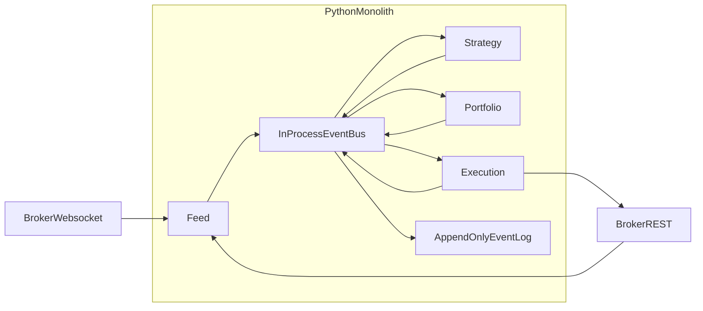
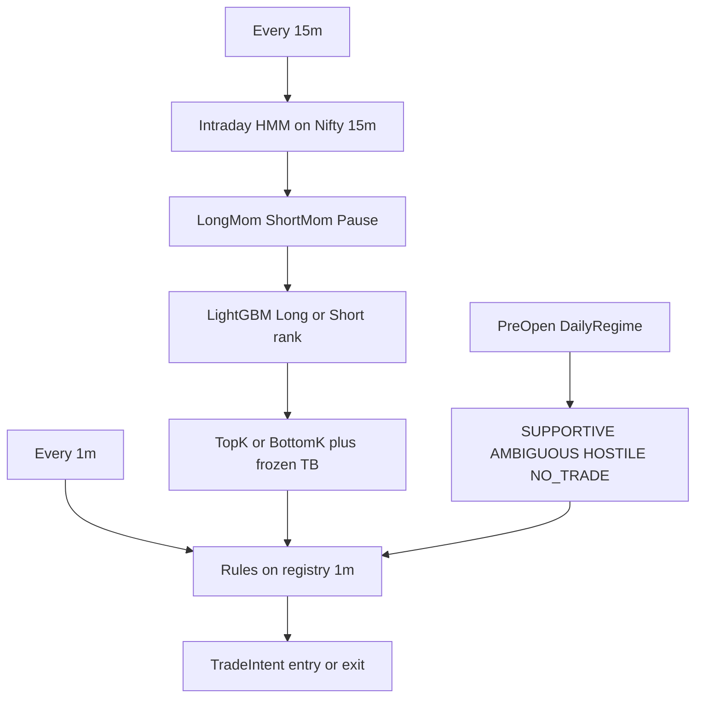
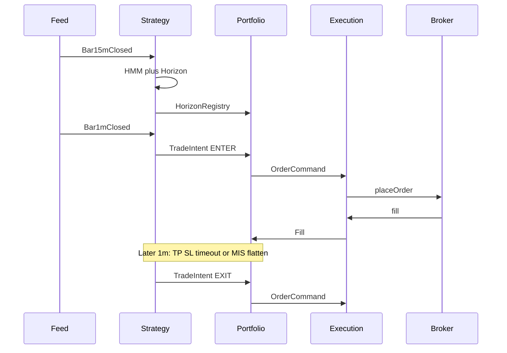

# Live Intraday Algo Platform — Architecture

**Market:** NSE India, Nifty 100 universe, intraday equities (MIS cash)  
**Date:** 2026-08-14  
**Scope:** live runtime. Independent of research pipelines. Strategy follows cascade contracts in [cascade-strategy-overview.md](cascade-strategy-overview.md); live loads exported artifacts and does not import `src/pipelines` at runtime.  
**Friction lock:** **0.20%** round-trip working (`c*`) — inherited from the cascade; do not re-derive here.

This document is the **locked v1 architecture** for Feed → Strategy → Portfolio → Execution. It is bar-cadence trading, not HFT: Precision fires on **1-minute bar close**; Horizon and Regime fire on **15-minute bar close**. The latency budget is **hundreds of milliseconds after bar close**, not microseconds after a tick. Sub-second module hops are required; sub-millisecond hops are not.

---

## Locked v1 decisions

| Decision | Choice | Why |
|---|---|---|
| Language | **Python 3.12+ modular monolith** | Strategy is already Python (HMM, LightGBM). 100 symbols of ticks is well inside asyncio. Polyglot doubles deploy/debug cost and fights time-to-market. |
| Process model | **One process, four modules, in-process queues** | Sub-ms hops, one crash domain, one deploy. Split processes only after a measured bottleneck. |
| Inter-module bus | **Typed in-process events + append-only event log** | Meets sub-second; no Redis ops in v1. |
| Redis Streams | **Defer** | Right for durable multi-consumer replay once you have **multiple processes or machines**. Wrong first bus for four modules on one box. |
| Go (Feed / Exec) | **Not v1** | Revisit if WS ingest or order-gateway latency is the measured bottleneck. |
| Research coupling | **Contract + exported artifacts only** | Frozen feature names, model files, TB widths. Live reimplements an **inference kernel**, not the research pipelines. |

Polyglot (Go Feed / Portfolio / Execution + Python Strategy) is a valid **later** split, not the first architecture. The Strategy process would still be Python; Redis/NATS would appear only at that split.



---

## Why Python monolith over microservices

Microservices are rejected for v1 because they optimize for **independent scale and independent teams**, and this platform has neither. It is one strategy, one broker, one session clock, four stages of a single pipeline.

### What microservices are for (and what this system is not)

Microservices pay for themselves when at least two of these are true:

- Different modules have **different scale curves** (Feed at 100k msg/s, Strategy CPU-bound, Execution IOPS-bound)
- Different modules are owned by **different teams** with independent release cadence
- You need **independent failure domains** that stay useful when a peer is down
- You need to **reuse** a module across many products (one Feed serving 12 strategies)

This live book has:

- One Nifty 100 universe, one cascade, one broker session
- One person / one small team, with time-to-market as the business goal
- A **linear, same-clock pipeline**: `Feed → Strategy → Portfolio → Execution`
- A latency budget of **hundreds of ms after 1m bar close**, not µs after a tick

None of the microservice forcing functions are present. The network hop, schema registry, consumer groups, and distributed tracing would be paying for an organization you do not have.

### The pipeline is tightly coupled on purpose

Cascade live trading is not four products. It is one decision that must stay consistent across modules in the same second:

| Hop | Why it cannot be eventually consistent |
|---|---|
| `Bar1mClosed` → Precision | Entry window is a few 1m bars after the 15m decision; a delayed bar is a missed or stale fill |
| `TradeIntent` → Portfolio | Exposure, sector, and daily PnL must be evaluated against the **current** book, not a stream replica that is 50–200 ms behind |
| `OrderCommand` → Execution → `Fill` | MIS flatten at ~15:00 is a clock, not a best-effort job. A partition between Portfolio and Execution during flatten is a real P&L event |
| `Halt` | Must stop **new entries** and still allow **exits** in the same process of record |

Redis Streams (or any broker) give **at-least-once, cross-process** delivery. That forces duplicates, reordering, and split-brain books **before** the first paper fill. In-process dispatch gives **exactly-once-in-this-process** for the hot path. Crash recovery is still “reconcile from the broker” in either architecture.

The one hop that looks microservice-friendly (Feed broadcasting bars) is also the cheapest to keep in-process: ~100 `Bar1mClosed` events per minute.

### Scale does not apply to this book

| Module | Why it cannot scale out |
|---|---|
| Feed | One broker websocket and one session token. Two replicas = duplicate ticks or a split subscription. |
| Strategy | One cascade state (daily regime, HMM sleeve, Horizon registry). Sharding 100 names splits the registry and violates “narrow downward.” |
| Portfolio | Single writer of exposure and PnL. Two Portfolio services are two books. |
| Execution | Bounded by **broker rate limits and order ACK latency**, not process count. |

Four always-on containers would do the work of one process, then spend the rest of the build on making them agree.

### Failure isolation is weaker than it looks

The honest argument *for* splitting is: “if Strategy segfaults, I still want Execution to flatten.” That is real. It does not require four microservices.

- If **Feed** dies, Strategy has nothing to say; isolation does not help.
- If **Strategy** dies, a monolith plus a tiny **watchdog** (clock + broker positions → flatten) covers this later. Execution can also listen to `MisFlatten` on its own.
- If **Execution** dies, a live Strategy is a liability (it keeps emitting intents against a dead gateway). Isolation is worse unless you add backpressure.
- After **any** crash, the broker — not Redis, not the in-memory book — is source of truth. Microservices do not remove reconcile; they add a second, stale copy of it.

The failure-domain win of microservices, for this system, collapses to “Strategy crash during the session.” That is a later extraction (Strategy process + shared bar stream), not a v1 topology.

### Two different claims (do not conflate)

**Strategy is Python-locked. Feed is not.** Putting Feed in the same Python process is a time-to-market choice, justified because Feed’s load is small. It is not because Strategy “forces” Feed’s language.

#### 1. Why Strategy cannot leave Python

The cascade’s live brain is:

- Intraday **HMM** (`hmmlearn` / GaussianHMM on Nifty 15m emissions)
- **LightGBM** Long and Short rankers (booster files + the exact feature columns the research export)
- Incremental **feature state** (rolling `r_15`, `rv_15`, relative strength, TB widths) that must match those columns

Those libraries, pickle/booster artifacts, and feature code are a Python numeric stack. Moving Strategy to Go means one of:

- Reimplement features + HMM + trees in Go (two numeric paths; live will drift from research)
- Export trees to ONNX/Treelite and still leave HMM + features in Python
- Run Strategy as a Python sidecar and call it from Go (this *is* the polyglot split)

So Strategy stays Python regardless of whether Feed is Go. A polyglot platform does not eliminate Python; it adds a second runtime *around* Python.

#### 2. Why Feed is allowed to be Python (not locked)

Feed’s job is I/O: read a broker websocket, update ~100 running 1m candles, emit bar-close events. That path is **not** the ML stack.

Retail broker quote WS for Nifty 100 (LTP/quote updates, not a co-located full tick tape):

| Bound | Order of magnitude |
|---|---|
| Symbols | ~100 cash + Nifty index |
| Per-name update rate | typically ~1–20 quotes/sec; hottest names higher in bursts |
| Aggregate peak | **hundreds to a few thousand messages/sec**, not 100k+ |
| Work per message | parse JSON/binary, update OHLCV dict, maybe enqueue |

Python `asyncio` is built for this shape (many sockets, little CPU per message). A few thousand small messages/sec is well inside one event loop. The 1m close burst is ~100 bar events at once.

Go would be the right Feed language if you were ingesting exchange-level tick-by-tick for thousands of names, or doing µs timestamping. That is not this book.

#### 3. What “the heavy work cannot move to Go anyway” means

| Clock | Work | Where | Cost |
|---|---|---|---|
| Every tick | Update 1m candle | Feed | microseconds per tick; I/O bound |
| Every 1m | Precision rules on the K-name registry | Strategy | cheap (rules on a handful of names) |
| Every 15m | Features + HMM + **two LightGBMs scored on ~100 rows** | Strategy | the actual CPU; still **milliseconds** if features are incremental |

LightGBM `predict` on a 100×N feature matrix is a few ms. HMM on one Nifty row is negligible. The only way this gets slow is a naive full Polars rebuild every bar — a kernel design issue, not a language issue.

If Feed is Go and Strategy is Python, Go does the easy I/O and then serializes bars into Python, where **all of the model work still runs**. You paid for a bus and two deploys to accelerate the side that was not the bottleneck.

**Python is forced on Strategy; Feed can be Python because it is easy; putting Feed in Go does not move the hard work.** Polyglot Feed/Exec remains a later extraction if you *measure* WS gaps or GIL stalls on the 1m close burst.

### Time-to-market

Business goal is **quick time-to-market**. Microservices v1 means four deployables, a bus with consumer groups, versioned schemas, and a distributed session clock before the first paper fill.

A modular monolith means four packages, typed events, one process, one paper Execution. First paper session is weeks earlier. **Module boundaries stay service-shaped** (no shared DataFrames, no reaching into another module’s book) so a later split is an extraction, not a rewrite.

This is **not** a big-ball-of-mud script. Each module owns private state. Communication is only typed events. Topic names match the Redis streams you would introduce later (`feed.bars.1m`, `strategy.intents`, …). That is microservice *design* without microservice *runtime*.

### When to reopen microservices (or polyglot)

Split **only** when a measured condition holds:

| Trigger | Extract |
|---|---|
| WS gaps or GIL stalls on the 1m close burst | Feed → separate process (Python or Go) |
| Strategy crash must not block flatten, and the watchdog is not enough | Strategy process + bar stream (Redis/NATS) |
| Second strategy, or second broker, sharing one gateway | Shared Feed + Execution services |
| Co-located order gateway / serious ACK latency work | Execution in Go |

Until then, four microservices would be an ops tax on a pipeline that must stay consistent in the same second.

---

## Inter-module communication

### v1: in-process event bus

Each module owns private state. Modules talk **only** through typed events.

Hot path (must be sub-second, typically under 50 ms in-process):

1. `Bar1mClosed` → Strategy Precision → `TradeIntent`
2. `TradeIntent` → Portfolio gates → `OrderCommand`
3. `OrderCommand` → Execution → broker
4. `Fill` / `OrderUpdate` → Portfolio book

Portfolio is **synchronous on the intent path**. Handlers run in the publisher’s task so a fill cannot race a PnL halt.

Warm path (every 15m, budget ~1–2 s):

1. `Bar15mClosed` (Nifty + stocks) → Regime HMM + Horizon rank → `HorizonRegistry`
2. Registry freezes names + TB widths for the next ~5 minutes of Precision

**Durability:** every event is also appended to a local JSONL log (session replay, audit, incident review). The log is **not** on the hot path and is **not** the recovery source of truth.

### Event contracts

Topic names are the Redis stream names used if processes split later.

| Event | Topic | Producer | Meaning |
|---|---|---|---|
| `Tick` | `feed.ticks` | Feed | Optional; candle build only. Precision v1 is 1m-rules. |
| `Bar1mClosed` | `feed.bars.1m` | Feed | IST minute bar-end OHLCV. `stale=true` if late; Strategy must not invent a bar. |
| `Bar15mClosed` | `feed.bars.15m` | Feed | Aggregated from 1m (not a second clock). |
| `FeedHealth` | `feed.health` | Feed | `ok` / `stale` / `gap` / `disconnected`. Bad health blocks **new** entries. |
| `HorizonRegistry` | `strategy.registry` | Strategy | K names, sleeve, frozen TP/SL/H, size_mult. `skipped` if Nifty 15m missing or 15m overrun. |
| `TradeIntent` | `strategy.intents` | Strategy | `ENTER` / `EXIT` / `SKIP` with `intent_id`. |
| `OrderCommand` | `portfolio.commands` | Portfolio | Accepted (possibly resized) intent. Idempotent `client_order_id`. |
| `IntentRejected` | `portfolio.rejects` | Portfolio | Reason code (exposure, sector, PnL stop, halt, `NO_TRADE`). |
| `Fill` | `execution.fills` | Execution | Book of record update for Portfolio. |
| `OrderUpdate` | `execution.updates` | Execution | `NEW` → `ACK` → `PARTIAL` / `FILLED` / `REJECTED` / `CANCELLED`. |
| `Halt` | `control.halts` | Control / Portfolio | Block new entries; exits still pass. `flatten=true` for kill-switch. |
| `SessionEvent` | `control.session` | SessionClock | `SessionOpen` / `CashOpen` / `MisFlatten` / `SessionClose`. |

### Why not Redis Streams in v1

Redis Streams fit **durable, multi-consumer, at-least-once** delivery across processes. They are a poor first choice here:

- Extra hop, serialization, and ops (AOF, consumer groups, pending entries) for a single box
- At-least-once means Portfolio/Execution **must** be idempotent anyway — so you pay Redis cost and still write the hard part
- Sub-second is easy in-process; Redis adds jitter you do not need yet

**Introduce Redis Streams (or NATS JetStream) when** Feed, Strategy, and Execution become separate processes **and** you need replay after a Strategy crash mid-session. Consumer groups: `strategy`, `portfolio`, `execution`, `audit`. Keys = `symbol` or `client_order_id` for ordering.

Until then, the in-process bus **simulates** those topics so the code shape stays the same.

---

## Module contracts

### 0. Session / control plane

Owns NSE calendar, IST clock, and kill switches. Everything else is a subscriber.

| Event | Wall clock (IST) | Meaning |
|---|---|---|
| `SessionOpen` | ~09:08 | Pre-open warmup done; daily regime may fire |
| `CashOpen` | 09:15 | Cash session; new 1m bars are live |
| `MisFlatten` | ~15:00 | Hard flatten (before broker ~15:15 square-off). Execution listens **directly** — not a strategy choice. |
| `SessionClose` | 15:30 | Session over |
| `Halt` | anytime | Manual (halt file) or risk-triggered |

Precision last-entry cutoffs stay cascade-locked: Long ~14:15 bar-end, Short ~14:00. Auction bleed bar (15m bar-end 09:30) is not an entry bar.

v1 session days: Monday–Friday. Holiday calendar is later.

### 1. Feed

**Inputs:** broker historical REST (warmup / gap-fill), broker websocket (ticks for ~100 names + Nifty index).

**Owns:**

- Token / session refresh
- Subscribe / resubscribe after disconnect
- Tick → **1m OHLCV** (bar close on IST minute boundary; bar-end stamp)
- 1m → **15m** bars (do not rebuild 15m from a second clock)
- Pre-open history window so Strategy features are warm at 09:15
- Universe: **today’s** Nifty 100 (+ Nifty index). Point-in-time membership is a research concern; live uses the current index list.

**Broker adapter** (one interface; Zerodha-class REST+WS is the first implementation):

- `subscribe(symbols)` — tick stream
- `history(symbol, interval, start, end)` — warmup / gap-fill
- `place` / `cancel` / `positions` / `open_orders` — used by Execution, not Feed

**Fail policy:**

- Symbol 1m late/missing → mark `stale`; Strategy **must not** invent a bar
- Nifty 15m missing → skip **new** Horizon entries that cycle; keep managing open exits
- WS disconnect → reconnect + REST gap-fill; `FeedHealth=disconnected` blocks new entries; exits still attempted via REST

### 2. Strategy (cascade inference kernel)

Not the research pipelines. A **live kernel** that consumes closed bars and emits intents.



| Cadence | Work | Output |
|---|---|---|
| Pre-open | Daily regime rules | Session risk gate |
| Every 15m | HMM sleeve + Long **or** Short LightGBM + TB widths/eligibility | `HorizonRegistry` (K names, direction, frozen TP/SL/H, size_mult) |
| Every 1m | Precision rules on registry only | `TradeIntent` (`ENTER` / `EXIT` / `SKIP`) |

Cascade invariants (do not weaken in live):

- Lower tier **narrows only** — never reverses Regime or re-ranks Horizon
- Separate Long vs Short models; no sign-flip
- No LLM in the gate
- Exits are frozen TB: TP / SL / timeout / `MIS_FLATTEN`

**Feature state** must be incremental (rolling windows on 1m/15m). Do not replay the full research Polars pipeline every bar.

**Artifact handshake with research:** export HMM + two LightGBMs + feature column lists + TB constants. Live loads files; it does not train. Suggested layout:

```
artifacts/live/manifest.json
artifacts/live/hmm.pkl
artifacts/live/horizon_long.txt
artifacts/live/horizon_short.txt
```

`manifest.json` holds `long_features`, `short_features`, `k_long` (5), `k_short` (3), `h_bars` (6), `round_trip_cost` (0.002), and HMM state map.

**TB widths (working `c*` = 20 bps), frozen at the 15m decision bar:**

- Long: TP = `max(2.5 × atr_pct, 60 bps)`, SL = `max(1.0 × atr_pct, 30 bps)`
- Short: TP = `max(2.0 × atr_pct, 50 bps)`, SL = `max(0.9 × atr_pct, 30 bps)`
- Vertical: `min(decision_bar + 90m, MIS_FLAT_BY ≈ 15:00)`
- Skip the name if vol-based TP cannot clear the cost floor (`tb_eligible`)

**Precision (1m, registry only):** bounded wait of 5 minutes from the 15m decision bar; pullback/reclaim (Long) or bounce/breakdown (Short); deterministic fallback so signals are not left hanging. Size from Horizon rank (1–2 → 1.0×, 3–5 → 0.7×). Shorts: afternoon cover gate, no same-session re-entry after SL.

Strategy listens to `Fill` to arm exit watchers (TP / SL / timeout). `HIGH_VOL` / `Halt` / bad `FeedHealth` block **new** entries; open positions keep frozen TB exits.

If the 15m cycle overruns its budget: skip **new** registry that cycle; keep last registry’s exits.

### 3. Portfolio

The only module allowed to say **yes** to risk. Evaluates each `TradeIntent` against **current-day** state:

- Gross / net exposure cap
- Per-name cap
- Sector cap (static NSE sector map)
- Daily realized + unrealized PnL stop
- Open order + position count
- Session Halt / `NO_TRADE` / `HIGH_VOL` (block **new** entries; exits still pass)

**Emits:** `OrderCommand` (accepted, possibly resized) or `IntentRejected` (reason code).

Portfolio is the book of record in-process. After a crash, it is **rebuilt from the broker**, not from the event log.

### 4. Execution

**Owns:** broker order API, order state machine, fill/order WS (or REST poll fallback).

- Idempotent `client_order_id` per intent (duplicate command is a no-op)
- States: `NEW` → `ACK` → `PARTIAL` / `FILLED` / `REJECTED` / `CANCELLED`
- Entry: **one** locked policy for v1 (`MARKET` or limit-at-touch — pick one; do not smart-route)
- Exit: same. **MIS flatten is a hard clock order:** Execution subscribes to `MisFlatten` and exits open positions even if Strategy is stuck
- Emits `OrderUpdate` and `Fill` onto the bus

**Paper mode:** same bus and modules; Execution is a simulator that fills at 1m close (or last tick). Ship paper for N sessions before live MIS.

---

## Runtime data flow (happy path)



---

## Failure, risk, and audit

| Failure | Live behavior |
|---|---|
| WS disconnect | Reconnect + REST gap-fill; **no new entries** while `FeedHealth` is bad; exits still attempted via REST |
| Strategy 15m overrun | Skip **new** registry that cycle; keep last registry’s exits |
| Broker reject / freeze | Surface `Halt`; cancel working; flatten or hold per kill-switch policy |
| Daily PnL stop | Portfolio rejects `ENTER`; still accepts `EXIT` |
| Process crash | Restart from broker **positions + open orders** (reconciliation). Event log is forensics, not recovery |
| Halt file present | Publish `Halt(flatten=true)`; block new entries |

**Audit:** persist `HorizonRegistry`, every `TradeIntent`, every Portfolio reason, every order/fill. This is how live is compared to the cascade’s backtest assumptions (20 bps working cost, frozen barriers).

---

## Deployment (v1)

- Single Mumbai VM (or `ap-south-1`), one Docker Compose service (or systemd)
- Secrets: broker token/refresh out of git
- Heartbeat + halt file for a human kill switch
- No Kubernetes, no service mesh, no shared Redis until a process split is real

---

## Build order (time-to-market)

1. **Bus + SessionClock + paper Execution** — prove 1m/15m events fire on IST
2. **Feed** — warmup + WS candles + gap-fill; persist bars
3. **Strategy inference kernel** — daily regime, HMM, Horizon, Precision rules; load exported models
4. **Portfolio gates** — exposure, sector, daily PnL, flatten clock
5. **Live Execution adapter** — idempotent orders + reconcile
6. **Paper N sessions** → small live size → full caps

Do not start with Redis, Go, or K8s. Keep module APIs clean so those remain a later extraction, not a rewrite.

---

## Document index

| Doc | Scope |
|---|---|
| **This file** | Live runtime architecture (process model, bus, module contracts) |
| [cascade-strategy-overview.md](cascade-strategy-overview.md) | Cascade contracts the live kernel must obey |
| [regime-tier1-verdict.md](regime-tier1-verdict.md) | Daily rules + intraday HMM |
| [horizon-tier2-verdict.md](horizon-tier2-verdict.md) | Long/Short LightGBM |
| [triple-barrier-verdict.md](triple-barrier-verdict.md) | TB widths, `c*`, MIS clock |
| [precision-tier3-verdict.md](precision-tier3-verdict.md) | 1m timing and exits |
