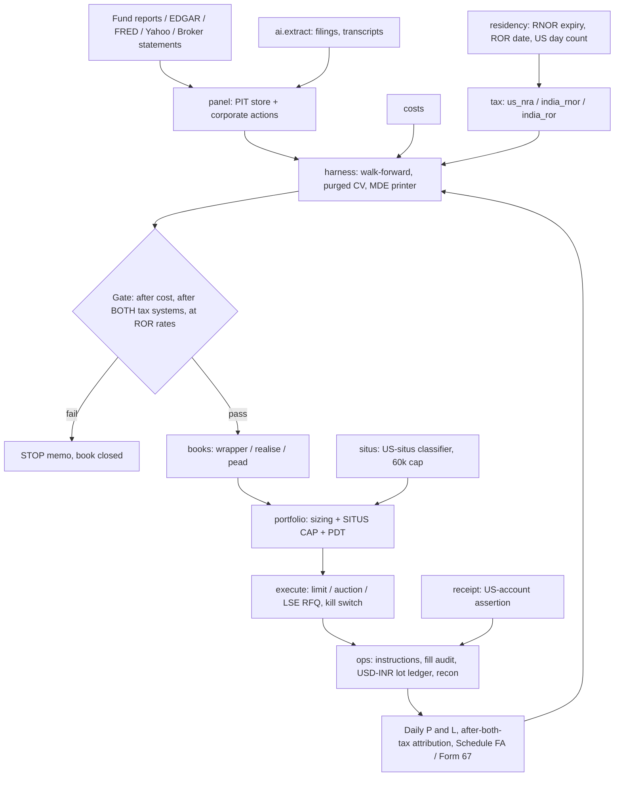

# Alien US desk — Architecture Blueprint

**Investor:** Indian citizen, **RNOR** (Resident but Not Ordinarily Resident) under Indian law for a working 2–3 year window, then **ROR** (Resident and Ordinarily Resident, taxed on worldwide income). **NRA** (nonresident alien) for US tax: not a US person, W-8BEN on file, India–US DTAA claimed.
**Market:** US listed equity-market products, plus Ireland-domiciled UCITS wrappers of the same exposure.
**Funding:** USD already held in US bank and brokerage accounts from a prior NRI period. Not LRS-funded. No incremental Indian FX required.
**Status:** **BLUEPRINT Rev 1.0** — new sibling programme. Nothing measured on this desk. All statutory rates are **working**, not a filed opinion.
**Date:** 2026-09-13
**Capital envelope:** $25,000 – $500,000, single taxable offshore book. No IRA analogue exists. The envelope is unchanged from the US-person desk, but it now has an internal break at **$60,000** (the NRA US estate-tax exemption), which is an architecture boundary, not a preference — see §0.2.
**Risk posture:** moderately aggressive (4/5) — cheap core ~75–80%; leftover ~20–25% may be multiple active sleeves. 4/5 does not cap sleeve count. Core-heavy, no leverage. US-situs still ≤ $60,000 unless W3 (N5); that is a situs lock, not 4/5.
**Relationship to the US-person desk:** this is **not** a revision of [us-equity-architecture-blueprint.md](us-equity-architecture-blueprint.md). That desk's market-structure, friction, and inference facts are reused as measured. Its **tax wrappers are not.** Its hurdles H1–H6, its IRA asset-location engine, its §1256 ranking, its wash-sale engine, and Book C's measured 35.5 bps/yr **do not transfer** and are not imported.

**Implementation map:** [alien-us-equity-execution-plan.md](alien-us-equity-execution-plan.md)

**Terms, defined once.** A **sleeve** is a capped slice of capital running one strategy. A **hurdle** is a number published before measurement that a book must clear or close. **MDE** is the minimum detectable effect — the smallest edge the available sample can resolve — computed as `2.8 σ / √n`.

---

## One-line

For an Indian RNOR investing already-held USD in US listed markets, the binding constraints are the **US estate-tax situs of US stock** and the **ROR cliff** — not alpha and not friction — so the platform is an Ireland-domiciled accumulating UCITS core sized to the whole book, a one-time basis step-up executed inside the RNOR window, and at most one active sleeve whose weight is capped by a $60,000 estate exemption rather than by risk appetite.

---

## 0. Derivation — the constraint ladder

Six rungs, worked in order. Alpha is last. Any rung can close a product outright, and on this desk rungs 1 and 2 close most of the menu before friction is ever consulted.

### 0.1 Rung 1 — Tax wrapper: two systems, two regimes, one taxpayer

This investor is taxed by two authorities whose rules do not line up, and the Indian side **changes character in 2–3 years**. Four cells, all **working**:

| Income | US (NRA, W-8BEN, DTAA) | India, RNOR | India, ROR |
|---|---|---|---|
| Dividends from US corporations and US-listed ETFs | **25%** withheld. IRC 871(a) is 30%; DTAA Art. 10 gives **15% only to a *company* owning ≥ 10% of the voting stock**, and **25% in all other cases**. An individual gets 25%. RIC/ETF dividends do not reach 15%. Without W-8BEN: 30% | **0** if received in a US account (not India-source, not received in India, not from a business controlled in India) | Slab, up to **~31.2%** with cess, with FTC for the 25% US withholding via Form 67 → marginal extra ~6.2% |
| Capital gains on listed US stock and ETFs (non-USRPI) | **0.** IRC 871(a)(2) does not tax an NRA's capital gains where the person is not engaged in a US trade or business and is not present 183 days in the year. No 1099; withheld FDAP is reported on 1042-S | **0** if received in a US account | Foreign listed shares are **not** STT-paid Indian equity. **s.196 / s.198 do not apply.** They are other capital assets: **> 24 months → 12.5% + 4% cess ≈ 13.0%**, no indexation, **no ₹1.25 lakh exemption**; **≤ 24 months → slab ≈ 31.2%** |
| Interest on USD cash | Bank deposit interest and registered-form portfolio interest are generally **not** 871-taxed | **0** if received in a US account | Slab |
| §1256 character (60/40) | **Irrelevant.** US capital-gains tax is already 0, so a character rule that blends 20% and 40% has nothing to blend | — | India has no §1256. Futures P&L may be characterised as business income |

Six consequences, all structural:

1. **During RNOR, turnover is tax-free on both sides.** A 12×/year strategy pays only friction. This is the exact inverse of the US-person desk, where rung 1's first finding was "40% tax on every gain." **It does not rescue a single closed strategy** — see consequence 3.
2. **The only US tax this desk pays is dividend withholding, and during RNOR it is a final, uncreditable cost.** India is not taxing that income, so there is no Indian tax to credit it against. On a US-listed 70/30 US/ex-US core that is **44.5 bps/yr of pure leakage** (§0.2, Table B). Getting the dividend wrapper right is the single largest recurring number on this desk.
3. **The RNOR window cannot certify anything.** It is 2–3 years long. A monthly sleeve gets 24–36 observations; a 12-cycle option sleeve gets 24–36 cycles. §0.4 shows both are closed by MDE without a peek. Certification plus 60 paper sessions plus 60 sessions at 10% size runs 18–30 months by itself. **By the time any book is certified, the window is gone.** Therefore: **design for ROR rates. Treat the RNOR window as a zero-tax operating bonus on whatever passes, never as a strategy class.** Any "RNOR-window-only" sleeve is closed — by inference, not by tax.
4. **There is no IRA, no Roth, no §475(f) relevance, and no qualified-dividend rate.** There is exactly one tax wrapper (a taxable offshore book) plus one genuine choice: **fund domicile**. "Asset location" collapses into "domicile," and domicile is decided once.
5. **The ROR cliff re-imposes turnover tax at ~31.2% on any hold ≤ 24 months.** The Indian long-term line for foreign shares is **24 months, not 12**, and the long rate is **13.0%**. The spread between them is **1,820 bps of realised gain** — larger than any edge this desk will measure.
6. **Deferral is the only remaining tax instrument, and an accumulating fund is the only tax-free-turnover vehicle available.** A distributing fund creates slab-taxable Indian dividend income every year after the cliff. An **accumulating** fund distributes nothing, so the dividend leg is rolled into the capital gain and taxed once, at 13.0%, at eventual sale. A packaged accumulating factor ETF bears its own rebalancing turnover internally and produces no investor-level realisation — the closest thing this taxpayer has to an IRA.

**Hard operating rule (tax, not preference): receive in the US, then optionally remit.** If a dividend or sale proceed is paid **directly into an Indian account**, it can be "received in India" and taxed there even during RNOR. One mis-routed wire on a $150,000 realised gain costs **$19,500 at 13.0%** or **$46,800 at slab**. This becomes hurdle N6.

**Rung 1 verdict:** no strategy on this desk is closed by the tax wrapper during RNOR, and every ≤ 24-month strategy loses ~31.2% of its gross after the cliff. Because the cliff arrives before any certification can finish, **every result on this desk is judged at ROR rates.** RNOR numbers are reported alongside, and never alone.

### 0.2 Rung 2 — Estate, situs, and domicile

This rung does not exist on the US-person desk. On this desk it is the binding constraint on the entire active budget.

**Stock of a US corporation — including shares of a US-listed ETF — is US-situs property.** An NRA's US estate-tax exemption is **$60,000** (working), delivered as a $13,000 unified credit, against a graduated schedule reaching 40%. There is no useful India–US estate-tax treaty for this. Form 706-NA is required whenever US-situs assets exceed $60,000 at death.

**Table A — US estate tax on a US-situs book (working, 2026 unified schedule):**

| US-situs market value | US estate tax | As % of that value |
|---|---|---|
| $60,000 | $0 | 0% |
| $100,000 | $10,800 | 10.8% |
| $200,000 | $41,800 | 20.9% |
| $500,000 | **$122,400** | **24.5%** |
| $1,000,000 | $332,800 | 33.3% |

A $500,000 VTI position carries a **24.5%-of-book contingent liability that arrives on a date nobody chooses**. Mortality-weighting it produces 5–30 bps/yr depending on age, but that framing is wrong: **you do not price a removable tail, you remove it.** There are exactly three exits, and they are not interchangeable:

1. **Change domicile.** Ireland-domiciled UCITS ETF shares are not US-situs. The estate exposure goes to zero and the dividend leg improves at the same time (below). Cost: wider dealing spread, higher TER, one working uncertainty (Irish CAT) for an advisor.
2. **Cap US-situs holdings at $60,000.** Hard, numeric, pre-trade enforceable. At a $500k book that is **12% of capital** — which is the entire active-sleeve budget, whether or not the risk posture wanted more.
3. **Price the tail.** Buy term life cover sized to Table A and treat the premium as a cost of the sleeve. Indicatively 3–10 bps/yr of the book at the relevant coverage — cheaper than the wrapper saving — but contingent on health, on jurisdiction, and on the payout reaching the estate in time. **This is the only lever that can lift exit 2's $60,000 cap, and it is therefore the only lever that can make an active sleeve large enough to matter.** It becomes milestone W3.

**Table B — core wrapper arithmetic (working; 70% US / 30% ex-US; 7.0%/yr gross; US yield 1.3%, ex-US yield 2.9%):**

| | Naive US-listed (VTI + VXUS) | **Irish physical accumulating (CSPX-class + ex-US)** |
|---|---|---|
| Blended TER | 3.6 bps | 10.9 bps |
| US-leg dividend withholding | 25% → 22.8 bps | 15% at fund level → 13.7 bps |
| Ex-US-leg **investor-level** withholding | **25% on US-source RIC distributions → 21.8 bps** | **0% Irish withholding to a non-resident holder → 0 bps** |
| Total recurring wrapper cost | **48.1 bps/yr** | **24.6 bps/yr** |
| **RNOR after-tax core** | **6.51%/yr** | **6.74%/yr** |
| Annual Indian dividend tax at ROR | slab on every distribution (~+11 bps) | **none — nothing is distributed** |
| US estate-tax situs | **100% of the book** | **0** |
| Annual Indian FTC / Form 67 paperwork | yes, forever | no |

Fund-level foreign withholding on the ex-US leg (~8–10% of that leg's dividends) exists in both wrappers and cancels; it is not counted as a saving.

**The single largest wrapper leak on this desk is a US-listed *international* equity ETF.** A fund like VXUS suffers foreign withholding inside the fund and then, because it is a US RIC, its distribution is US-source FDAP withheld at **25%** — the §871(k) exemptions cover interest-related and short-term-capital-gain dividends, not foreign equity dividends. That is **~72.5 bps/yr on the ex-US leg, lost to double withholding, recoverable nowhere.** The Irish equivalent loses 0 bps at the investor level.

**Rung 2 verdict — core wrapper decision, taken here and not deferred:**

> **The core is Ireland-domiciled, accumulating, USD-line UCITS, bought on LSE. US-listed ETFs are closed as core holdings. Distributing UCITS are closed. Luxembourg is permitted only where no Irish equivalent exists (0.05%/yr subscription tax). Aggregate US-situs market value is capped at $60,000 unless W3 prices the tail.**

The wrapper is worth **23.5 bps/yr recurring**, removes a **24.5%-of-book** estate tail, and eliminates the annual Indian dividend-tax and FTC machinery after the cliff. It requires **no forecast and no vendor data.** Below a ~$60,000 book the estate rung does not bind and US-listed is acceptable; the wrapper still wins on the dividend leg, and the ROR cliff still binds at every size. That is why the envelope was kept at $25k–$500k rather than raised: above ~$500k the estate arithmetic and the single-machine posture both argue for an entity or trust structure, which is a different programme.

**Cash has a situs too.** US bank deposits and directly held US Treasury bills are estate-exempt for an NRA (working, IRC 2105(b)). Shares of a **US money-market fund are RIC shares and therefore US-situs.** The cash sleeve lives in bank deposits and T-bills, never in a US MMF.

**Working items an advisor must confirm before any capital moves:** Irish CAT treatment of UCITS units held by a non-Irish-resident, non-domiciled holder; whether the 1953 India–US estate-tax convention has any surviving effect; and the situs of listed derivatives.

### 0.3 Rung 3 — Friction and market structure

**Unchanged from the US-person desk and reused as measured.** These are product-structure facts, not tax facts. Round-trip cost, all-in, at retail size (**working**, to be calibrated against own fills at N0):

| Product | All-in round trip |
|---|---|
| SPY / VTI / QQQ | **1.2–2.0 bps** |
| Top-200 large-cap stock | **1.5–3 bps** |
| Mid-cap, $ADV $20–100M | **10–25 bps** |
| Small-cap, $ADV $2–20M | **45–120 bps** |
| MES | **0.6–0.9 bps** |
| SPX ATM, 30–45 DTE | **1.0–2.0% of premium** |
| XSP ATM | **5–9% of premium** |
| SPX ~10-delta wing | **12–30% of premium** |
| **Irish UCITS, USD line on LSE** (new) | **8–15 bps** at small size, 4–8 bps at $100k+ clips; no UK SDRT on Irish-incorporated shares; **no FX leg — the USD line is bought with already-held USD** |

Structural facts that carry over without change: **PDT (FINRA 4210) applies** — it is a broker rule, not a tax-residency rule; 4+ day trades in 5 rolling sessions requires $25,000 equity. **T+1 and Reg T apply.** **No short stock in v1** — borrow cost, locate, and recall risk are unchanged by residency. **SIP latency:** any edge that decays inside one second is closed permanently, no exceptions.

New friction specific to this desk: the core is bought on a London venue, so the dealing spread is 5–10× a US ETF's. Amortised over a 20-year hold that is **under 1 bp/yr**, and the core is bought once. It matters only if the core is traded, which the design forbids.

**Rung 3 verdict:** friction closes the same products it closed for the US person. It additionally makes the UCITS core a buy-and-hold instrument by construction — which is what rungs 1 and 2 wanted anyway.

### 0.4 Rung 4 — Inference budget

`MDE = 2.8 σ / √n`. Gate: publish n, σ, and MDE **before** any peek. If MDE > 0.5 × the hypothesized effect, the book closes without a peek. Trial budget **5 pre-registered specifications per book, α = 0.01**, deflated for trials run, abandonments logged.

| Book shape | n | σ per obs | Hypothesized | **MDE** | Ratio | Gate |
|---|---|---|---|---|---|---|
| **Monthly sleeve, RNOR window only (3 yrs)** | 36 | 300 bps | 300 bps | **140 bps** | 0.47 | borderline — and the window ends before the sample completes |
| **12-cycle option sleeve, RNOR window only** | 36 | 150 bps | 116 bps | **70 bps** | **0.60** | **CLOSED without a peek** |
| Discretionary, 20 trades/yr, 5 yrs | 100 | 200 bps | 56 bps | 56 bps | 1.00 | **CLOSED** |
| Long-horizon factor-tilt comparison, 15 annual obs | 15 | 600 bps | 150 bps | **434 bps** | **2.89** | **CLOSED as a measurable book** |
| Daily overnight rotation, 5 yrs | 1,260 | 110 bps | — | 8.7 bps | — | resolvable, but closed at rung 3 |
| **Event panel, name-events, 2010–2026 history** | 30,000 | 800 bps | 100 bps | 13 bps | 0.13 | **pass** |
| Same, after 5× clustering haircut | 6,000 | 800 bps | 100 bps | **28.9 bps** | 0.29 | **pass** |

**The decisive reading.** Discovery runs on *history*, not on the investor's residency. A 2010–2026 event panel has 6,000 effective observations regardless of when the RNOR window falls. A book whose **tape is the RNOR window itself** has 24–36 observations and is closed. So the inference rung sorts the menu cleanly:

> **Books measurable on history survive. Books that would have to be measured live, inside the tax-free window, are closed — and the tax-free window is exactly the period in which a high-turnover book would have been most attractive.** That is the central tension of this desk, and it resolves against the window.

The long-horizon factor comparison also fails the gate. That does not mean no tilt: it means a tilt is permitted as a **cost-arithmetic decision with no alpha credited to it**, never as a measured book (§0.6).

### 0.5 Rung 5 — Capacity and eligibility

Capacity is reused from the US-person desk and rarely binds at $25k–$500k: it closes micro-cap, single-name option books, and OTM wings. **Eligibility is new, and it binds hard.**

| Item | Status | Consequence if breached |
|---|---|---|
| **W-8BEN on file, Indian PAN as foreign TIN** | Required before any dividend | Withholding jumps 25% → 30%. A foreign TIN is generally accepted in lieu of a US TIN for publicly traded securities income, so **no ITIN is needed** — unless a product forces a 1040-NR filing |
| **IRC 864(b)(2) safe harbor** | Hard operating lock: trading **stocks, securities, and commodities for one's own account** is not a US trade or business. Dealers are excluded | If the desk were ever a US trade or business, **all** gains become US-taxable at graduated rates and the entire model inverts. Therefore: own capital only, no third-party money, no customers, no dealer inventory, no market-making, no advertised performance |
| **183-day / substantial-presence test** | Hard ops lock: count US days every year | ≥ 183 days present and the investor is a US resident alien; the 871(a)(2) capital-gains exemption disappears retroactively for that year |
| **IRC 871(m)** | Withholding on dividend equivalents from delta-one and deep-ITM equity-linked instruments. Broad-based **qualified indices** (S&P 500 class) are excluded (working) | Closes or taxes anything that looks like synthetic single-stock exposure |
| **FIRPTA / IRC 897 / 1445** | REIT capital-gain distributions and non-domestically-controlled REIT sales are USRPI | **Reimposes US capital-gains tax, 15–21% withholding, an ITIN, and a 1040-NR filing** on an investor who otherwise files nothing in the US |
| **Aggregate US-situs ≤ $60,000** | Pre-trade enforced (rung 2) | This is the **binding capacity constraint** on every US-listed sleeve above a $60k book, ahead of ADV |
| **Broker will hold Irish UCITS for an India-resident client** | **Unconfirmed. This is a gate, not a footnote** | If no broker on the USD will hold UCITS, the entire rung-2 verdict is unexecutable and the core falls back to US-listed under a $60k cap plus a priced tail |
| PDT, Reg T, locate, SPAN | Broker rules; unchanged by residency | Unchanged |

**Rung 5 verdict:** eligibility closes REITs outright (they are the only US product that reimposes US capital-gains tax and a US filing on this investor), constrains every US-listed position to a $60,000 aggregate, and makes broker/product access a first-order milestone rather than an implementation detail.

### 0.6 Rung 6 — Alpha (only now)

**The rebuilt baseline — this is the number every book must beat.** Not "after-tax VTI." The benchmark is an **after-tax accumulating Irish UCITS core hold**, 70/30 US/ex-US, 7.0%/yr gross nominal, 16% vol, Sharpe ~0.40 (all **working**):

| | Value |
|---|---|
| **RNOR after-tax core** | **6.74%/yr** (7.00 − 0.109 TER − 0.137 withholding; Indian tax 0) |
| **ROR after-tax core, deferral preserved** | **6.74%/yr** — accumulating, so nothing is distributed and nothing is realised |
| **ROR accrual-equivalent worst case** | **≈ 5.38%/yr** — 13.0% applied annually to the **INR-measured** gain. At 3.5%/yr working INR depreciation the INR gain is ~10.5%/yr, so the accrual-equivalent Indian tax is **~136 bps/yr**, not the ~91 bps a USD-only calculation suggests |
| Same core held in US-listed form | 6.51% RNOR / 6.40% ROR pre-realisation, plus the full estate tail |

Two things follow. First, **the truth for a 20-year hold sits near the deferred end**, so 6.74% is the working benchmark and 5.38% is the stress case; both are reported. Second, **INR depreciation is itself an Indian taxable gain after the cliff.** A flat USD book pays Indian tax. This affects every wrapper equally, so it does not change the rung-2 ranking — but it makes the basis step-up (§1, Book R) substantially more valuable than a USD-only calculation shows.

What is known about US equity return structure, re-judged for **this** taxpayer:

| Phenomenon | Real? | Verdict on this desk | Killing rung |
|---|---|---|---|
| Equity risk premium | Yes | **VIABLE — this is the core**, in an accumulating Irish wrapper | — |
| Wrapper / domicile arithmetic | Deterministic | **VIABLE — Book W, rank 1.** 23.5 bps/yr + removal of a 24.5%-of-book estate tail | — |
| Pre-cliff basis step-up | Deterministic | **VIABLE — Book R, rank 1 and date-critical.** Illustratively 300–860 bps of capital, one time | — |
| PEAD in liquid mid-caps | Attenuated, present in mid | **CANDIDATE-GATE — Book E, the only gated alpha candidate**, and it is capped by estate situs | rung 2 (situs), then rung 1 (ROR) |
| Index volatility risk premium | Yes, a risk transfer | **CLOSED.** The US-person desk measured IV−RV **4.91** vol pts vs spread round-trip **4.14** = **1.19×** against a pre-registered **2×** (n=173, MDE 31.9 bps, 2026-08-22). **It failed pre-tax.** The §1256 subsidy that ranked it is worth exactly **0** to an NRA whose US capital-gains rate is already 0. **Do not reopen on a tax story.** Reopening needs new data | rung 6 (measured) |
| Momentum, value, quality, low-vol | Attenuated but not zero | **Permitted as an accumulating UCITS tilt at ≤ 20% of the core, with no alpha credited.** MDE 434 bps vs a 150 bps hypothesis closes it as a measurable book (§0.4). DIY sorts closed | rung 4 |
| Overnight close-to-open split | Real | **CLOSED.** 378 bps/yr of crossings. RNOR tax relief does not reopen it, and the window cannot certify it | rung 3 |
| Day trading, intraday scalping | — | **CLOSED.** PDT, SIP latency, adverse selection, cost > edge. The RNOR zero-tax window is not a reason to reopen a friction failure | rung 3 |
| 0DTE | Volume phenomenon | **CLOSED as alpha.** Hedge instrument only | rungs 3, 6 |
| Leveraged-ETF decay harvest | Decay real | **CLOSED.** Borrow on the short leg, disguised short gamma, already in the price, plus situs | rung 6 |
| Cross-sectional long/short | — | **CLOSED.** Borrow, recall, and no short stock in v1 | rung 3 |
| Russell reconstitution / index flow | Flow real | **CLOSED.** n = 1/yr, front-run, mid/small spreads | rungs 3, 4 |
| FOMC / CPI event drift | Debatable | **CLOSED as alpha.** n = 20/yr. Permitted only as a variance-reduction overlay | rung 4 |
| OPEX / calendar | Small, crowded | **CLOSED.** Sub-cost | rung 3 |
| LLM news-sentiment prediction | — | **CLOSED.** Tradeable half-life under one second | rung 3 |
| ETF NAV arbitrage | AP-only | **CLOSED.** Structurally impossible for retail | rung 5 |
| Micro-cap | — | **CLOSED.** Capacity and spread | rung 5 |
| Short-rebate / fully-paid lending income | — | **CLOSED.** Substitute payments in lieu of US dividends are US-source and withheld at **25%**; the fee is a broker-set minority share; and lending requires holding US-situs stock, which the $60k cap forbids at scale | rungs 1, 2 |
| §475(f) election | — | **Not applicable.** A US character election for a taxpayer with no US capital-gains tax | — |
| **Tax-loss harvesting** | Deterministic elsewhere | **DEFERRED, not adopted.** Zero value during RNOR (capital-gains tax is 0 on both sides, so a realised loss offsets nothing). At ROR there is **no IRC 1091 wash-sale rule** in India — same-day sell-and-rebuy is permitted, subject to GAAR — which is genuinely better than the US regime, but a buy-and-hold desk realises no gains for the loss to offset, so the loss merely carries forward 8 years. **Book C's measured 35.5 bps/yr is not imported and no harvesting number is claimed** | rung 1 (RNOR), rung 6 (ROR) |
| **Futures core (rolled MES)** | Deterministic | **CLOSED as a core.** See below | rung 1 (ROR cliff) |

**Why the futures core is closed, worked explicitly** — because it looks attractive and must be killed on the ladder, not on taste. A rolled long MES position embeds the index's **gross** dividend in the futures price, so an NRA pays **no** dividend withholding at all, saving the full 13.7–32.5 bps; MES round-trip is 0.6–0.9 bps; futures escape PDT; own-account commodity trading is inside the 864(b)(2)(B) safe harbor; and a qualified-index future is outside 871(m). Every one of those is true. It still dies: **a quarterly roll is a realisation every three months.** After the cliff, that is slab-rate ~31.2% on the entire year's gain, every year, forever, with a live risk that India characterises futures P&L as business income. On 7.0% gross that is **218 bps/yr** of Indian tax against **~91 bps/yr** accrual-equivalent for the deferred accumulating core — **the futures core loses by roughly 127 bps/yr, against a 26 bps dividend saving.** The same arithmetic kills the US-person desk's elegant trick of correcting portfolio drift with an MES overlay instead of selling stock: after the cliff that converts a deferred 13.0% into a realised 31.2%. **MES is retained only as a short-dated hedge, where the P&L is small and intentional, and as a free beta-adjustment tool inside the RNOR window. It is not the core and it is not the rebalancing mechanism at ROR.**

---

## 1. Candidate books, ranked

Ranked by expected after-cost, after-both-tax contribution **per unit of research risk**.

### Book W (rank 1) — Wrapper: domicile, withholding, accumulation, situs

- **Hypothesis.** For an NRA/RNOR, the largest reliable and capacity-unconstrained source of return is not price prediction and not harvesting but **choosing the fund domicile and the distribution policy**: an Ireland-domiciled accumulating USD-line UCITS cuts US-leg dividend withholding from 25% to 15%, cuts ex-US-leg investor-level withholding from 25% to **zero**, removes 100% of the book's US estate-tax situs, and — after the cliff — converts an annually slab-taxed dividend stream into a once-taxed 13.0% capital gain with no Form 67 machinery.
- **Instrument.** Irish-domiciled, accumulating, USD-denominated UCITS on LSE: an S&P 500 or US-total-market line (CSPX-class, ~0.07% TER) at ~70% and an ex-US line (~0.18–0.22% TER) at ~30%; or a single FTSE All-World accumulating line at ~0.22% for simplicity. Horizon: permanent.
- **Effect size.** **23.5 bps/yr recurring**, plus removal of a **24.5%-of-book** contingent estate liability, plus ~11 bps/yr of avoided Indian dividend tax after the cliff, plus the elimination of annual FTC filing. Verified by **arithmetic** against published TERs, published treaty rates, and the funds' own audited withholding disclosures — **not** by a statistical peek.
- **Why it exists in 2026.** It is not a market price. It is a per-taxpayer fact that the overwhelming majority of Indian RNORs holding US brokerage accounts do not compute, because the US-listed product is the one their broker shows them first.
- **Already packaged?** No. There is no product that sells you the right domicile; there is only the choice.
- **Kill criteria.** If no accessible broker will hold Irish UCITS for this client (W1), Book W reduces to: US-listed core under a hard $60,000 situs cap plus a priced estate tail, and the 23.5 bps is forfeited. That is a **degraded pass, not a closure** — the situs cap and the receipt rule survive regardless.
- **Not a source of "excess."** Book W **sets the benchmark**; it does not beat it. Its 23.5 bps is the **penalty avoided** by getting the wrapper right, and it is deliberately excluded from the N1 excess calculation so the arithmetic is not double-counted. **If this programme does nothing else, do Book W.**
- **AI role.** None.

### Book R (rank 1, and first in time) — RNOR basis step-up and the realisation schedule

- **Hypothesis.** During RNOR, a realised capital gain on a US listed security is taxed at **0% by the US** (871(a)(2)) and **0% by India** (not received in India, not India-source, not from an India-controlled business). Therefore **selling and repurchasing the entire book inside an RNOR tax year permanently erases the accumulated gain from both tax systems and restarts the Indian 24-month clock from a fresh, high basis.** There is no wash-sale rule in either regime that this violates. The action is one-time, deterministic, capacity-unlimited, forecast-free — and it **expires** with the RNOR window.
- **Instrument.** Whatever the book holds, sold and repurchased in the same wrapper, with all proceeds received in the US account. Best executed **after** Book W's domicile switch, so the step-up and the wrapper migration are one transaction rather than two.
- **Effect size — illustrative and working; the real number is computed at R0.** A portfolio bought ten years ago at USD 200k, now USD 400k, with INR at ~62 then and ~92 now: the INR-measured gain is ~₹2.44 crore, of which ~₹0.60 crore is pure FX accretion. At 13.0% that is **~₹31.7 lakh ≈ USD 34,500 on a USD 400k book = 863 bps of capital**, erased once, permanently. On a book with only 30% embedded gain the figure is nearer **390 bps**. Amortised over a 20-year horizon: **15–43 bps/yr equivalent**, and it is the highest-certainty number in this document.
- **Permanent component.** Beyond the one-time step-up, Book R is the standing realisation discipline: **the 24-month line** (13.0% vs ~31.2%, a 1,820 bps spread), Indian set-off and 8-year carry-forward rules, and the **receive-in-the-US rule** (N6).
- **Kill criteria.** If a written cross-border opinion (W1) does not support the step-up — GAAR, substance, or a residency-year timing problem — the one-time action is dropped and only the standing 24-month discipline remains. **The one-time action is irreversible and date-bound, so the opinion must precede it.**
- **AI role.** None. Ops only: the lot ledger.

### Book E (rank 2, the only gated alpha candidate) — Post-earnings drift, long-only, US single names under the situs cap

- **Hypothesis.** Earnings information is incorporated with a lag where coverage is thin and attention is scarce, showing up as 5–40 day drift in the direction of the surprise, attenuated in mega-caps and possibly present in the $2–20B band.
- **Instrument and horizon.** US common stock, $ADV > $20M, top ~1,500 by liquidity, 5–40 day hold, **long-only** (the short leg is closed by borrow), no MES hedge at ROR (it would realise gain). **Every position is US-situs**, so the sleeve competes for the $60,000 budget with everything else US-listed.
- **What transfers and what does not.** The US-person desk's **measured** screens transfer because they are pre-tax: B0 listed mid-cap 20-day net **80.9 bps** (n=17,143, survivorship-biased); B0.5 Item 2.02 **82.3 bps** (n=13,907), missing-tape weight **w = 12.9%**, **zero-drift bound 71.7 bps**. Not certified — Lock 5 still requires delisted prices. The **IRA housing** that made the US-person version work does **not** transfer: there is no IRA.
- **Re-derived arithmetic for this taxpayer:**

| | US person (measured) | **This desk** |
|---|---|---|
| Survivorship-corrected bound, net of cost | 71.7 bps/event | 71.7 bps/event (same tape) |
| Turnover tax on the sleeve | 0 (IRA) | **0 in RNOR; ~31.2% slab at ROR** |
| Effective kill threshold (40 bps *after* tax) | 40 bps | **58 bps** (= 40 / 0.688) |
| Bound vs threshold | 1.79× | **1.24×** |
| Permitted sleeve weight | 25% (IRA capacity) | **12% at $500k** — the $60k situs cap, not risk appetite |
| Implied sleeve excess over the core | — | **≈ 429 bps/yr at ROR** (~929 bps at RNOR) |
| Implied book-level excess | — | **51 bps at w = 12%** · **107 bps at w = 25%** |

- **Effect size needed.** N2 asks **500 bps/yr of sleeve excess over the rebuilt core at ROR rates**. The measured bound implies ~429 bps. **Pre-registered now, before any peek: Book E is expected to miss N2 by roughly 15% at the $60,000-capped weight.** The one legitimate path to a pass is **W3 — pricing the estate tail** to lift the cap from $60k to an insured amount, which raises w to 25% and turns 429 bps of sleeve excess into 107 bps of book excess. That branch is published here, in advance, so that exercising it later is not a goalpost move.
- **The killing rung, if it dies, is rung 2 — estate situs — not alpha and not the ROR cliff.** That is the most counter-intuitive finding on this desk and it is the reason W3 exists.
- **Why the obvious workarounds are closed.** An offshore holding company would hold the US stock outside the investor's US-situs estate — but at ROR it becomes an Indian-resident company under place-of-effective-management and is taxed as one. **Closed.** Options instead of stock have unsettled situs, 871(m) exposure, and the same delta. **Closed.** No Irish UCITS runs PEAD. **Closed.**
- **Kill criteria.** Pooled net-of-cost drift below **58 bps/event after ROR tax** on ≥ 6,000 clustered events; or the effect lives only below $20M ADV; or the situs cap cannot be lifted to a weight that delivers N1; or the effect is fully explained by momentum and short-interest controls.
- **AI role — real and specific.** An LLM builds **point-in-time features from unstructured text**: 8-K Item 2.02 surprise language, guidance-direction change, and the language delta between successive calls. Hard rules: the model sees only text published before its label timestamp; it outputs **features, never a return forecast**; every extraction is cached, versioned, and re-runnable; and the incremental value of text over numeric surprise is reported separately or the LLM is removed.

### Explicitly closed on this desk

Index volatility risk premium (measured pre-tax fail; do not reopen on a tax story) · futures core and MES band-rebalancing at ROR · day trading and intraday scalping · 0DTE as alpha · overnight rotation · DIY taxable factor sorts · leveraged and inverse ETFs · cross-sectional long/short · Russell reconstitution and all index-flow books · FOMC/CPI event alpha · OPEX and calendar effects · LLM news-sentiment prediction · ETF NAV arbitrage · micro-cap · fully-paid lending and short-rebate income · short stock · US preferreds · convertibles · ADRs · US-listed international equity ETFs · US-listed sector and factor ETFs · REITs and all US real-property vehicles · buy-write and covered-call ETFs · volatility ETPs · distributing UCITS · US money-market funds as a cash sleeve.

---

## 2. Product mandate — the full retail US menu

Every retail-accessible US equity-market product, with the rung that kills it. **Rejecting is the intended behaviour.**

| Product | Verdict | Binding rung and reason |
|---|---|---|
| **Irish accumulating UCITS, USD line (physical)** | **VIABLE — the core** | Passes all six. 15% fund-level US withholding, 0% investor-level, non-US-situs, no distribution to slab-tax at ROR |
| **Irish accumulating UCITS (synthetic, qualified index)** | **CANDIDATE-GATE (W2)** | Recovers most of the remaining 15% by holding a swap on a qualified index, outside 871(m) (working). Gated on measured tracking difference, counterparty caps, and 871(m) regulatory risk |
| Irish **distributing** UCITS | **CLOSED** | Rung 1. The 15% fund-level withholding is uncreditable to the investor **and** the distribution is slab-taxed at ROR. Strictly worse than accumulating |
| Luxembourg UCITS | **CLOSED vs Irish** | Rung 1. 0.05%/yr subscription tax. Permitted only where no Irish equivalent exists |
| **US Treasury bills held directly; US bank deposits** | **VIABLE — the cash sleeve** | Not 871-taxed, estate-exempt for an NRA (working) |
| **US money-market funds** | **CLOSED** | Rung 2. RIC shares are US-situs even though §871(k) may exempt the distribution |
| **US common stock, single names** | **CANDIDATE — Book E vehicle only, under the cap** | Rung 2. Every share is US-situs; the sleeve competes for $60,000. At ROR, ≤ 24-month holds are slab |
| **Broad US-listed ETFs (VTI/ITOT/SPY/QQQ)** | **CLOSED as core; permitted as hedge/trading vehicles inside the cap** | Rungs 1 and 2. 25% dividend withholding and 100% US-situs |
| **US-listed international ETFs (VXUS/VEA/VWO/IEFA)** | **CLOSED — the worst wrapper leak in the document** | Rung 1. Foreign withholding inside the fund, then **25% US FDAP on the distribution** because a US RIC's dividend is US-source. ~72.5 bps/yr lost, recoverable nowhere |
| US-listed factor ETFs (MTUM/QUAL/VLUE/USMV) | **CLOSED**; UCITS equivalents permitted as a ≤ 20% no-alpha-credit tilt | Rungs 1, 2, 4. Situs plus 25% on a 1.5–2% yield; and the comparison is unmeasurable (MDE 434 bps) |
| US-listed sector ETFs | **CLOSED** | Rungs 2, 6. No book needs them; sector timing is not a gated candidate |
| **ADRs** | **CLOSED** | Rungs 1, 3. Depositary fees of 5–20 bps/yr; home-country withholding uncreditable during RNOR; situs unsettled. A UCITS ex-US fund does the job cheaper |
| **US preferreds** | **CLOSED** | Rung 1. 25% withheld on a 6%+ yield that **is** the whole return — ~150 bps/yr, uncreditable in RNOR. Dead on the first rung |
| **Convertibles** | **CLOSED** | Rungs 3, 5. The coupon may qualify as tax-free portfolio interest (§871(h)) and the conversion gain is 0-taxed — genuinely attractive, and it does not survive a 50–200 bps OTC spread, $100k new-issue minimums, and no inference budget. The listed CWB alternative is a US RIC withheld at 25% |
| **REITs and US real-property vehicles** | **CLOSED — hardest close on the desk** | Rungs 1, 2, 5. FIRPTA/§897/§1445: capital-gain distributions and non-domestically-controlled sales are USRPI, which **reimposes US capital-gains tax, 15–21% withholding, an ITIN, and a 1040-NR filing** on a taxpayer who otherwise files nothing in the US — destroying the 871(a)(2) exemption that this entire desk rests on. Plus US-situs |
| **Buy-write / covered-call ETFs (JEPI/XYLD/QYLD/PUTW)** | **CLOSED — worst product class for this taxpayer** | Rung 1. 7–12%/yr distributions, almost all ordinary income or ELN income, US-source FDAP at **25%**. A 9%-yielding fund costs ~**225 bps/yr** of withholding, uncreditable in RNOR, on a product whose total return already trails the index |
| **Leveraged / inverse ETFs** | **CLOSED** | Rungs 2, 6. Decay already in the price, borrow on the short leg, disguised short gamma, US-situs |
| **Volatility ETPs (UVXY/SVIX/VIX futures)** | **CLOSED** | Rungs 3, 6. Roll cost in the price; ETN withholding character unsettled; the short-vol income line already failed at 1.19× |
| **US-listed single-name options** | **CLOSED** | Rungs 5, 3, then 1. Quote moves on 20–50 contracts; 1.5–3% of premium; and **871(m)** withholds dividend equivalents on deep-ITM calls |
| **Listed index options (SPX/XSP/NDX)** | **CLOSED as a book; permitted as a hedge instrument** | Rung 6. IV−RV **1.19×** vs a **2×** hurdle, measured pre-tax. §1256 is worth 0 here. SPX remains the correct hedge instrument (European, cash-settled, qualified index → outside 871(m)) |
| SPY / QQQ options | **CLOSED** | Rungs 1, 6. 871(m) exposure on ITM; no §1256 advantage to forgo; the hedge role is already filled by SPX |
| **0DTE** | **CLOSED as alpha; same-day hedge only** | Rungs 3, 6. Realised ≈ implied at the one-day horizon; 1–3% of premium per round trip |
| **Micro index futures (MES/MNQ/ES)** | **CLOSED as core and as the ROR rebalancing tool; VIABLE as a short-dated hedge and as free RNOR-window beta adjustment** | Rung 1. The quarterly roll realises everything: ~218 bps/yr of Indian tax at ROR vs ~91 bps deferred in the accumulating core — a ~127 bps/yr loss against a 26 bps dividend saving. Also a live risk that India characterises the P&L as business income |
| **Options on futures** | **CLOSED** | Rung 6. No book needs them once Book V is closed |
| **Fully-paid securities lending** | **CLOSED** | Rungs 1, 2. Substitute payments in lieu of US dividends are US-source and withheld at **25%**; you must hold US-situs stock to lend it; and the fee is a broker-set minority share, not a strategy |
| **Short stock** | **CLOSED in v1** | Rung 3. Locate, general-collateral 0.25–0.5%/yr, hard-to-borrow 5–100%+, recall at the worst moment |
| **Day trading / intraday scalping** | **CLOSED** | Rung 3. PDT (a broker rule, unaffected by residency), SIP latency, adverse selection on internalised flow. The RNOR zero-tax window does **not** reopen a friction failure |
| **Overnight close-to-open rotation** | **CLOSED** | Rung 3. ~378 bps/yr of crossings against a 300–500 bps gross drift concentration. Tax-free in RNOR and still sub-cost |

---

## 3. What the platform is — and is not

**Is:**

- A **cheap passive accumulating core** in Ireland-domiciled USD-line UCITS, 88–100% of capital, held permanently, rebalanced by band **without realising gain after the cliff**.
- A **situs and receipt engine.** Two hard, pre-trade, arithmetic gates: aggregate US-situs ≤ $60,000, and every cash leg lands in a US account. These are this desk's analogue of the US-person desk's PDT counter — regulatory arithmetic enforced in code, not judgement.
- A **residency-aware tax model.** `tax` takes a **residency calendar**, not a rate. The same trade has three different answers depending on the tax year it falls in.
- A **dated wrapper plan.** The step-up has a deadline; the alpha work does not. Ordering follows the deadline.
- At most **one active sleeve**, weight capped by rung 2, which has cleared a published numeric hurdle at **ROR** rates.
- A **daily instruction list**, an **intended-vs-actual fill audit**, a **broker reconciliation**, a **USD lot ledger with INR conversion**, and — once ROR — **Schedule FA and Form 67 artefacts**.

**Is not, in v1:** an event bus, Redis, Kafka, a feature store, a tick-replay engine, Kubernetes, a multi-broker abstraction, an intraday execution algo, a regime model, an ML experiment tracker, an offshore holding company, a trust, a currency hedge, or a live account used as a research lab.

The v1 system runs once per session on one machine, writes a CSV of orders, and reconciles at 16:30 ET. The entire edge in Books W and R is available at that cadence — in fact Book R is available at a cadence of *once*.

---

## 4. Platform architecture

### 4.1 Data: $0 authorized now; one named SKU later, and it may already be paid for

**Programme discovery-data ceiling: $0 of new spend.** The only later-authorizable SKU is **Norgate US Stocks Platinum** (3-week trial, then $346.50/6 months, dump-and-cancel) at milestone **E1**, and only if E0 clears. **The US-person desk has the same SKU authorized for its B1 on the same window and the same panel. One purchase serves both programmes. If that desk buys it first, this programme spends $0.** Spend to date on this programme: **$0**.

| Source | Cost | Role | Authorized when |
|---|---|---|---|
| Broker (IBKR) historical + live | included | Quotes, fills, paper, 1042-S, corporate actions, UCITS eligibility confirmation | N0 / W1 / L0 |
| Fund KIIDs, prospectuses, **audited annual reports** | free | **Actual** withholding suffered, TER, accumulation policy, swap counterparties — the Book W evidence base | **Now (W0 / W2)** |
| LSE / Euronext / SIX published spreads and RFQ | free | UCITS dealing-cost bucket | Now (N0) |
| SEC EDGAR (submissions API, full-text, Item 2.02, Form 25/15) | free | PIT filings, delisting identifiers | Now (U0 / E0) |
| Yahoo / FRED / index provider factsheets | free | Listed bars, rates, INR/USD, index TRI | Now |
| Broker statements and the investor's own lot history | free | **The Book R embedded-gain ledger — the single most important input on this desk** | **Now (R0)** |
| Norgate US Stocks Platinum | trial $0, then $346.50/6mo | Delisted EOD + historical constituents — the E1 PIT panel | **E1 only, if E0 clears, and only if not already bought for the US-person desk** |
| Polygon / EODHD | $79–199/mo | Fallback delisted prices | Only if the Norgate trial cannot deliver, inside the same $346.50 |
| Sharadar or any PIT fundamentals | ~$100/mo | Book E consensus panel | **Only if E1 passes** |
| Cboe DataShop / OPRA / CGI / Optsum | $$$ | Options tape | **CLOSED.** Book V is closed on a pre-tax measurement. Do not buy an options tape on this desk |
| Databento, CRSP | $$$$ | Microstructure, academic PIT | **No. Ever, at this capital scale** |

**One non-data purchase is authorized, and it comes first.** A **written cross-border tax opinion** (US NRA + India RNOR/ROR), ceiling **$1,500–$3,000**, authorized at **W1** and required **before R1**. This is a professional-services line, not a vendor SKU; the $0-paid-data discipline is unchanged. It is the one purchase that must happen before any capital moves, because R1 is irreversible and date-bound.

Non-negotiable data rules, unchanged: every panel carries a **point-in-time timestamp and a knowledge date**; delisted and acquired tickers present before Book E is *certified*; corporate actions from one canonical source, unit-tested against three known splits and three known special dividends.

### 4.2 Modules

| Module | Responsibility | Notes |
|---|---|---|
| `costs` | Spread and fees by product bucket, **plus an LSE/UCITS bucket and a zero-FX assertion for USD lines** | First-class object, unit-tested. Every backtest imports it |
| `tax` | **Rewritten, not reused.** Takes a **residency calendar**. `us_nra`: 871(a) FDAP 25% with W-8BEN, capital gains 0, 871(m) flag, 897/1445 flag. `india_rnor`: 0 on foreign passive income, with a **receipt-location** input. `india_ror`: 24-month line, 13.0% LTCG on the **INR-measured** gain, slab ~31.2% STCG, dividends at slab with FTC, 8-year carry. **No IRA, no §1256 mark, no IRC 1091 wash-sale engine** | Unit-tested against hand-worked examples in **both** regimes, including a transition-year case |
| `situs` | **New.** Per-holding US-situs classification and a **hard $60,000 aggregate pre-trade block** | This desk's PDT counter. A breach blocks the order |
| `receipt` | **New, small.** Asserts every dividend, sale proceed, and interest payment routes to a US account | An ops lock with a five-figure tax consequence |
| `residency` | **New.** RNOR/ROR calendar, RNOR expiry date, **US physical-presence day counter** with a 183-day tripwire | Drives `tax` and the R1 deadline |
| `universe` | PIT listing panel, ADV, delistings, ETF metadata, **UCITS domicile and accumulation flags** | Inherits the US-person U0 artefacts |
| `panel` | Daily and event panels aligned on knowledge date | Typed, `df in → df out` |
| `harness` | Walk-forward, purged + embargoed CV, **MDE printer**, trial ledger, deflated Sharpe | **Refuses to run until n, σ, and MDE are printed** |
| `books.wrapper` | Book W: domicile comparison, withholding arithmetic, estate table, accumulation policy | Deterministic |
| `books.realise` | Book R: embedded-gain ledger, step-up simulation, 24-month clock, Indian set-off and carry | Deterministic |
| `books.pead` | Book E: event panel, surprise features, ranking, **situs-capped sizing** | |
| `ai.extract` | LLM filing/transcript extraction, cached and versioned | **Features only** |
| `portfolio` | Sizing, gross limits, **situs cap**, beta band, PDT counter | |
| `execute` | Broker adapter, limit/MOC/LOC, **LSE RFQ path for the UCITS core**, kill switch, dry-run | |
| `ops` | Instruction list, fill audit, P&L vs broker, **USD lot ledger with INR conversion**, Schedule FA / Form 67 artefacts, recon | |

### 4.3 Component flow

### 4.4 Execution posture

The core is bought in **large, infrequent clips** on LSE inside the 09:35–16:20 London window, using limit orders and an RFQ where the clip exceeds displayed size; never at the open or close. Book E, if it ever runs, uses US limit orders in the 09:35–15:55 ET window and MOC/LOC for daily rebalances. Every session begins in dry-run: generate, diff against live positions, then arm. Kill switch on three triggers: daily loss > 1.5% of equity, broker API error rate above threshold, or quote staleness beyond 90 seconds. **The `situs` cap and the `receipt` assertion block orders outright — they are not warnings.** Paper for 60 sessions, then live at 10% of target size for 60 sessions, then full size.

**Exception, stated explicitly so a later agent does not block it:** the Book W domicile migration and the Book R step-up are **wrapper transactions, not strategy deployments.** They are authorized before L0 and are not "live capital before a book passes." They are also date-bound, which no strategy is.

### 4.5 Risk limits (v1)

| Limit | Value |
|---|---|
| **Aggregate US-situs market value** | **≤ $60,000** unless W3 passes; then ≤ the insured amount |
| Max single-name weight | 4% of equity |
| Max active-sleeve gross | 12% of equity at $500k (the situs cap); 25% only if W3 passes |
| Max daily loss (kill switch) | 1.5% of equity |
| Max option sleeve max-loss-at-expiry | 8% of equity (hedges only) |
| Beta band around target | ±0.10, corrected **by cash flow, not by MES, after the cliff** |
| Naked short options | Prohibited |
| Short stock | Prohibited in v1 |
| Overnight leverage | ≤ 1.0× in v1 |
| **Receipt of any cash leg into an Indian account** | **Prohibited during RNOR. Zero tolerance** |
| **US physical presence** | Tracked; hard alert at 150 days in a calendar year |
| Live capital during research | $0 except N0 tiny calibration fills and the W/R wrapper transactions |

### 4.6 AI layer — jobs, not thesis

**Permitted:** point-in-time filing and transcript extraction (Book E features); event detection and calendar normalisation; reconciliation and situs-classification anomaly explanation; **Schedule FA / Form 67 draft generation from the lot ledger**; code generation, test writing, documentation. **Prohibited:** any model whose output is a return forecast consumed by sizing; any signal whose provenance cannot be reconstructed to a timestamped source document; any AI-generated tax conclusion that is not confirmed by the written opinion.

### 4.7 Not in v1 — explicit

Tick replay · custom matching engine · Kubernetes/Docker · Redis/Kafka · feature store · MLflow · HMM or regime models · LightGBM/XGBoost/RL · multi-broker abstraction · options market making · crypto · intraday execution algos · web dashboard · **offshore holding company** (closed at rung 1 by Indian place-of-effective-management) · **currency hedge** (see §6).

---

## 5. Hurdles and STOP language

Published before any measurement on this desk, and not adjustable after seeing a result. **These are the N-series. They are this desk's hurdles, derived from this taxpayer. They are not the US-person desk's H1–H6 and the two sets do not move together.**

| ID | Hurdle |
|---|---|
| **N1** | **Programme gate.** Total book, after cost and after **both** tax systems, must beat the **rebuilt after-tax accumulating-UCITS core hold** by **≥ 60 bps/yr at ROR rates**, with excess-return Sharpe ≥ 0.5. *Derivation, so this number is not arbitrary:* Book W sets the benchmark and earns no excess by construction; Book R contributes **15–43 bps/yr** amortised; for the programme to be worth its operational risk an active sleeve must at least double the deterministic contribution. **200 bps is not imported** — it was unreachable on the US-person desk even with a 25% IRA-housed sleeve, and this desk's sleeve is capped at 12% by estate situs. |
| **N2** | **Sleeve minimum.** Any active sleeve must beat the rebuilt core by **≥ 500 bps/yr at ROR rates** at its permitted weight. *Derivation:* N1 / w with w = 12% at $500k. Book excess is the identity `w × (sleeve − core)`. **Pre-registered:** the existing measured PEAD bound implies ~429 bps, i.e. Book E is expected to miss N2 by ~15% at the capped weight, and the only published path to a pass is W3. |
| **N3** | **MDE printed before every peek.** If MDE > 0.5 × the hypothesized effect, the test is not run and the book closes. Unchanged from the US-person desk and not weakened. |
| **N4** | Modelled cost must match realised fills within **3 bps** (US equities and ETFs), **5 bps** (LSE UCITS lines), or **0.3% of premium** (options) before any size increase. |
| **N5** | **Situs cap.** Aggregate US-situs market value **≤ $60,000** at all times, enforced pre-trade. A breach blocks the order. The cap lifts only to a **W3-insured amount**, never on judgement. |
| **N6** | **Receipt location.** Every dividend, sale proceed, and interest payment lands in a **US** account during RNOR. **Zero tolerance** — one mis-routed wire on a $150,000 gain costs $19,500–$46,800. |
| **N7** | Trial budget **5 pre-registered specs per book, α = 0.01**, deflated for trials run, abandonments logged. A sixth spec requires new pre-registration and a fresh data window. |
| **N8** | **Every result reported twice: at RNOR rates and at ROR rates.** Gross-only is not a result, and an RNOR-only result is not a result either. Where they differ, **ROR governs** — because N3 shows the RNOR window cannot certify anything, so no book will ever be certified in time to enjoy it. |
| **N9** | **Per-book minimums.** Book W: ≥ 15 bps/yr of measured recurring wrapper saving **and** a documented path to zero US-situs on the core. Book R: the step-up must be worth ≥ 100 bps of capital at R0 to justify the transaction and the opinion cost. Book E: ≥ **58 bps** net drift per event **after ROR tax** on ≥ 6,000 clustered events. |
| **STOP** | **If Book R is executed and no active sleeve clears N2 at ROR rates, the programme stops.** Capital sits 100% in the accumulating UCITS core, under the situs cap, the receipt rule, and the 24-month realisation schedule. Reopening requires *new data*, not new specifications. |

**Say this out loud, because it is the likely outcome and it is a good one.** The STOP branch still delivers **23.5 bps/yr of avoided wrapper leakage, a one-time 300–860 bps basis step-up, removal of a 24.5%-of-book US estate tail, and the permanent elimination of annual Indian dividend tax and FTC filing** — for zero research risk, zero forecast risk, and **$0 of vendor spend.** A negative result that is honestly measured is a successful milestone. Recording it and stopping is the intended behaviour.

---

## 6. Risks unique to this desk

| Risk | Mitigation |
|---|---|
| **Broker will not hold Irish UCITS for an India-resident client** | **W1 is a gate, not a footnote.** Get it in writing before anything else. Fallback: US-listed core under the $60k cap plus a priced tail, and forfeit 23.5 bps |
| **A cash leg is received in an Indian account during RNOR** | `receipt` module blocks; standing broker instruction pins the settlement account; N6 zero tolerance |
| **Losing the RNOR window before R1 executes** | R0/R1 are sequenced **first** in the plan, ahead of all alpha work, because they are the only date-bound items. The opinion is bought before, not after |
| **GAAR or substance challenge to the step-up** | Written opinion before R1; the transaction is an ordinary market sale and repurchase at arm's length, not a structure; the lot ledger is contemporaneous |
| **India characterises futures or high-turnover P&L as business income at ROR** | Futures core already closed. Book E is delivery-based long-only equity. No F&O book exists on this desk |
| **871(m) regulatory change removing the qualified-index exception** | W2 gates the synthetic wrapper on this exception; physical is the default and needs no reliance on it |
| **Irish CAT on UCITS units** | Named as **working**; on the advisor's confirm list before R1. If CAT applies, the estate exit reverts to the $60k cap plus a priced tail |
| **Substantial-presence trip (≥ 183 US days)** | `residency` day counter, hard alert at 150 days. The whole model inverts if this trips |
| **864(b)(2) safe harbor loss** | Own capital only. No third-party money, no customers, no dealer inventory, no market-making, no performance advertising. Any of those changes the legal entity and is out of scope |
| **A US filing obligation appears (FIRPTA, refund claim)** | REITs and all USRPI closed precisely to avoid this. An ITIN is not obtained unless a form forces it |
| **USD book against future INR consumption** | **Deliberate, unhedged, un-modelled.** No FX view is taken and no currency alpha is claimed. Note the tax consequence: at ROR the 13.0% applies to the **INR-measured** gain, so INR depreciation is itself a taxable gain — which is a reason to step up, not to hedge |
| **Schedule FA / FSI disclosure after the cliff** | Working assumption: RNOR is not required to disclose foreign assets the way ROR is. **Keep the full lot ledger from day one regardless** — the ROR obligation is retrospective in its reach, and a ledger cannot be reconstructed later |
| Tax-lot drift vs broker records | Reconcile monthly; the broker's records and the 1042-S are authoritative for filings |
| Importing the wrong desk's arithmetic | This blueprint imports **pre-tax measurements only.** Book C's 35.5 bps, the §1256 wedge, the 40/20 rates, IRA location, and H1's 200 bps are **not** on this desk |
| Using the live account as a research lab | Research runs on historical panels. The live account executes only the W/R wrapper transactions and gate-passed books |
| Over-fitting via spec search | Trial ledger, pre-registration, deflated Sharpe, embargoed CV, N7 |
| Single-machine failure | Positions survive machine loss by construction (no intraday dependence); nightly encrypted state backup |
