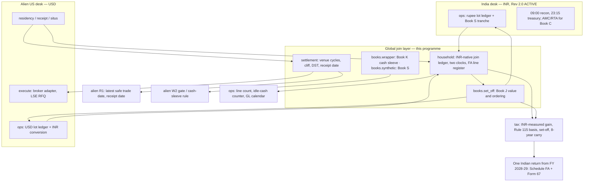

# Global programme — Architecture Blueprint

| | |
|---|---|
| **Date** | 2026-09-14 |
| **Status** | **BLUEPRINT Rev 1.0 / DRAFT** |
| **Review** | Claude Opus |
| **Scope** | The join between the two existing desks, and the wrapper configuration layer on top of them. **Not a third equity tape and not a third OMS.** |
| **Product authority** | [global-financial-market-analysis.md](../archive/global-financial-market-analysis.md) (2026-09-14). Verdicts consumed, not re-judged |
| **Taxpayer** | [investor-profile.md](../investor-profile.md) · calendar [residency-calendar.md](../residency-calendar.md) |
| **Companion** | [global-equity-execution-plan.md](global-equity-execution-plan.md) |
| **Existing desks** | India **ACTIVE**: [blueprint](india-equity-architecture-blueprint-rev2.md) Rev 2.0 (declined-beta carry; milestone map §13). Alien US: [blueprint](alien-us-equity-architecture-blueprint.md) Rev 1.0 + [plan](alien-us-equity-execution-plan.md) |
| **Does not implement** | India Rev 1.0 (`docs/archive/india-equity-architecture-blueprint.md`) — **SUPERSEDED 2026-09-14**. Do not authorise a Nifty-beta core from it |
| **Imports pre-tax only** | [us-equity-architecture-blueprint.md](us-equity-architecture-blueprint.md) Rev 1.2. No IRA, no 40–20, no §1256, no Book C 35.5 bps, no H1 200 bps |

Every number not sourced to a statute, circular, exchange rule, fund document or a desk artefact is tagged **(working)** with a verification owner in [Appendix A](#appendix-a--working-numbers-register). Milestone IDs in this programme carry the **GL-** prefix. `docs/next/g0-charter.md … g3-charter.md` are unrelated and are not reused.

---

## One-line

Once the alien desk owns an Ireland-domiciled accumulating USD-line UCITS core and the India desk owns a **low-beta rupee carry core**, **there is no third equity book to build** — so the smallest production-grade global system is a **date-bound settlement calendar** that protects a measured 240 bps step-up, an **INR-native household join ledger** that lets one PAN net two currencies from FY 2028-29, a **line-count and wrapper register** that keeps the disclosure surface small, and **session-overlap rules inside the alien desk's `execute`** — four facilities, two new modules, one new book module, and **$0** of new spend.

---

## 0. Derivation — the system ladder

The product ladder is already worked in the analysis (rungs 1–7) and is **imported, not re-derived**. What follows re-orders those facts as **platform** constraints: what the desk is allowed to build, in the order that decides it. Alpha is last and it is empty.

### 0.1 Rung 1 — Funding decides the adapter set

FEMA s.6(4) plus RBI A.P. (DIR Series) Circular 90 (Jan 2014) means the only global products reachable at all are those buyable with **already-held USD through the existing offshore custody chain**. Anything needing rupees needs LRS, which the mandate forbids assuming.

**System consequence, and it is the largest one in this document:** a funding rule this tight means **no new adapter can be funded.** India demat, US/LSE brokerage, and listed derivatives are different adapters; LSE already sits on the alien adapter. MCX, GIFT/IFSC, INR feeders, and every local developed or EM exchange are closed at rung 1, so no code is written for them. **The global programme therefore adds zero venues, zero brokers, zero run loops, and zero order paths.** The join is a ledger.

### 0.2 Rung 2 — Ownership: which desk owns the instruction

Two custody chains, two currencies, two settlement cycles, one PAN. Nothing physically connects them and nothing should: no cross-margining path exists, LRS runs one way and is not the funding path, and a repatriation is a wire whose tax character is set by what was realised.

**System consequence:** the global layer **emits no orders of its own.** Every instruction it influences is placed by the desk whose currency funds it — `execute` on the alien path for USD lines; the India desk's **09:00 recon / 23:15 treasury** windows and **15:00 IST MF cut-off** for the carry core (AMC/RTA, no broker API). Event legs on the INR adapter exist only if Books E or I open. This programme contributes rules and numbers to those paths and owns neither. A dual-listed name lives in one book only, the one whose currency funds it.

### 0.3 Rung 3 — Date-boundedness ranks the work

Exactly one item on this board has a deadline. The alien desk's Book R step-up is worth a **measured 240 bps of current INR capital** (₹8.14 lakh on the ₹3.39 crore marked book, `docs/archive/r0-embedded-gain.md`) and the working cliff is **31 Mar 2028**. The realisation is trade-dated; the **receipt** is settlement-dated, and N6 governs the receipt. A step-up trade in the last days of March 2028 settles in FY 2028-29, when the taxpayer is ROR.

**System consequence:** the calendar is built **first**, before any ledger and any wrapper refinement, because it is the only thing that expires. It is also the cheapest artefact on the board.

### 0.4 Rung 4 — Measurement currency forces the ledger's shape

At ROR the Indian return computes the foreign gain **in rupees**. A flat USD book still produces an Indian taxable gain from INR depreciation. Indian set-off rules do not care which currency produced a loss, so from FY 2028-29 a loss on one desk can shelter a gain on the other — and **no single-desk document can see it**, because each desk sees one currency.

**System consequence:** the join ledger is **INR-native**, built by reading each desk's own lot ledger rather than by re-deriving lots, and it carries the **12-month Indian line and the 24-month foreign line as separate clocks**. The INR conversion basis (Rule 115 / TT rate, on which date) is unresolved and belongs to W1, so the ledger stores the **rate source and date per lot** and treats the basis as swappable. A change in W1's answer must be a re-run, not a rebuild.

### 0.5 Rung 5 — Disclosure surface is a platform variable

Every additional foreign holding is a Schedule FA row against a **₹10 lakh per year** Black Money Act s.43 penalty regime **(working)**. Against that, the measured fee gap between the two candidate core configurations is **3.31 bps/yr** — about **$117/yr ≈ ₹11,000/yr** on the $354,097 marked book.

**System consequence:** the platform **counts lines** and refuses to grow the count silently. Line count is not a cost variable that a fee comparison can settle on its own; it is a compliance-risk variable with an asymmetric tail, and it belongs in `ops` as a register.

### 0.6 Rung 6 — Venue fixed cost and session overlap

Adding Xetra, Tokyo and Hong Kong to an IBKR-class account costs roughly **$30/month of market data (working)** — **144 bps/yr at the $25,000 floor**, 10.2 bps/yr on the marked book, 7.2 bps at $500k. Almost every UCITS line worth owning has a **USD line on LSE**. Local transaction taxes (UK SDRT 0.5% on UK-incorporated shares; HK 0.1%/side; CH 0.15/0.30%; FR 0.3%; IT 0.1%; ES 0.2% — all **working**) make every direct-share route 3–10× the packaged route before withholding and situs are counted.

Session overlap is an execution fact, not a trade: a US-exposure line dealt on LSE before 14:30 London is made against a stale index; a World ex-USA line has no Asia overlap ever and loses Europe at 15:30 London; four weeks a year the overlap starts an hour earlier, at **13:30 London (working)**.

**System consequence:** **one venue, one market-data subscription, no FX leg**, stated as a rule rather than rediscovered per product — and the overlap rules live in the alien desk's `execute` as windows per exposure class. They are not a book and they do not get a module.

### 0.7 Rung 7 — Inference: nothing to build

Every global premium fails `MDE_ann = 2.80 σ_ann/√T` against ½ E_net by **4.8× to 15.8×** on history alone, before the 24-month foreign line converts an annual-rebalance sleeve to slab ~31.2%. Listing-basis arbitrage is the one phenomenon whose MDE arithmetic is comfortable and it is **measured negative** — a 2–6 bps gap against an 8–15 bps round trip.

**System consequence, and it is a veto:** `harness` gets **no change** and no global pre-registration is authorized. A predictive harness whose only job is to re-examine premia closed at 4.8×–15.8× is refused. The five global books are ledger, calendar and document arithmetic; none of them has an n.

### 0.8 Rung 8 — Alpha

Empty. Stated as a result. The correct global posture is the existing accumulating UCITS core correctly configured, the existing India desk, a shared ledger, and nothing else.

---

## 1. What v1 is — and is not

**Is:**

- A **settlement and cliff calendar** (`settlement`) that turns a trade date into a receipt date across India T+1, US T+1 and LSE T+2 (T+1 targeted **11 Oct 2027**, working), knows the working cliff **31 Mar 2028**, knows the UK BST switch on **26 Mar 2028**, and publishes a **latest-safe-trade-date** for the step-up.
- An **INR-native household join ledger** (`household`) over both desks' lot ledgers, with two long-line clocks, a Schedule FA line register, and one total-India-exposure line.
- A **cross-book set-off book** (`books.set_off`, Book J) that measures what one Indian return is worth to a household with two books, live from **1 Apr 2028** and not a day before.
- A **wrapper configuration layer**: the post-cliff cash sleeve arithmetic (Book K) inside the existing `books.wrapper`, the non-US synthetic gate (Book S) inside the existing `books.synthetic`, and a one-shot composition disclosure (Book Q) that is a document, not a runtime book.
- **Execution rules on the alien path**: LSE session-overlap windows per exposure class, with a documented precedence order when the cliff calendar and the window disagree.
- An **enforcement surface**: the closed product list as a registry the code refuses, optional sleeves at **default weight zero**, and a hard refusal on any capital transfer between the two books.

**Is not, in v1:** a third run loop · a third broker or a fourth venue · a routing or netting layer between the desks · a fourth OMS · a global universe or panel · a predictive harness for closed premia · a currency module · a gold book or a duration book · a paid data SKU · an offshore HoldCo · an FX hedge · a repatriation strategy. Nor is it Redis, Kafka, K8s, Docker orchestration, tick replay, a matching engine, a multi-broker router, a web dashboard, FIX, colocation, an intraday loop, or a second machine — none of which exists anywhere in this repo.

**The global programme adds zero sessions to the daily loop.** GL0, GL2 and GL4 are one-shot artefacts. GL1's ledger runs on the alien desk's existing daily reconciliation. GL3 becomes relevant on 1 Apr 2028.

---

## 2. Candidate books, as the analyst ranked them

Rank, kill number and product verdict are the analyst's and are not re-judged. What is specified here is the **system shape**: where the code lives, when it is first needed, and which desk owns the resulting instruction.

### Book T (rank 1, first in time) — cliff, settlement and receipt calendar

- **Why it exists.** The 240 bps step-up is executed across venues and settlement cycles that nobody currently owns. The failure mode is a **trade-date / receipt-date straddle across the cliff**.
- **System shape.** **No `src/books/` module.** Book T *is* `src/settlement.py` plus a dated artefact `docs/archive/gl0-cliff-calendar.md`. A book module whose only content is a calendar already held in a shared module is duplication, and it is vetoed (§11).
- **Interface.** `settlement.receipt_date(trade_date, venue) -> date`; `settlement.latest_safe_trade_date(cliff, margin_days) -> date`; `settlement.session_window(exposure_class, date) -> (open, close)`. It **consumes** `residency` for the cliff date and does not redefine it.
- **Owner of the resulting action.** Alien **R1**. This programme supplies the date; R1 places the trade.
- **Constraint, not a design.** Execute with **≥ 14 calendar days** of margin before 31 Mar 2028 — working latest safe trade date **17 Mar 2028** (GS1) — and keep the sell-to-repurchase gap to **≤ 5 business days** (GS2), both to avoid market risk and to stay clearly inside the FEMA Reg 7 "reinvested" reading.
- **Kill.** None. It exists before R1 or R1 runs blind.
- **AI role.** None.

### Book J (rank 2) — the household join ledger and cross-book set-off

- **System shape.** `src/household.py` (the shared INR ledger — a single source, like `costs` and `tax`) plus `src/books/set_off.py` (the measurement and the ordering rules). `tax` is extended with the INR-measured foreign gain, a named swappable Rule 115 / TT rate basis, cross-book set-off, and the 8-year carry. **No book re-implements `tax`.**
- **Build rule.** The join ledger is **derived, never authoritative**: it reads each desk's lot ledger and must reproduce each to **₹1 and $0.01**. Two clocks, never merged.
- **Kill (analyst's).** Measured value **< 25 bps of combined capital** → fold the rule into India **Book S** (Rev 2.0 tranche / realisation ledger; not global Book S) and alien Book R and close the book. At the marked books (₹3.39 crore + ₹50 lakh design ≈ **₹3.89 crore**) that kill line is about **₹97,000** (GS3), against an estimated ₹65,000–₹1.56 lakh. **Pre-registered here: Book J straddles its own kill and may well close.** The ledger survives either way, because Schedule FA and Form 67 need it.
- **Open tax question, forbidden to this programme.** Whether other-asset losses set off against s.198 gains carrying the ₹1.25 lakh exemption (G5). W1 only.
- **AI role.** None on the numbers. A read-only prose note on a ledger diff is permitted (§8).

### Book K (rank 3) — post-cliff cash sleeve wrapper

- **System shape.** An extension of the existing `src/books/wrapper.py` — a cash-sleeve line beside the equity-core lines. **No new module.**
- **Kill (analyst's).** Sleeve **< ~$50,000** or saving **< 30 bps/yr on the sleeve** → hold T-bills. Worth **0 during RNOR**.
- **Pre-registered expectation.** $50,000 is **14.1% of the $354,097 marked book** (GS4). Unless the cash sleeve is at least that large, Book K fails its own floor, and the FEMA Reg 7 "invested, not idle" argument may be the larger half of the case. During RNOR the 180-day exposure is already answered by directly held T-bills, which are instruments and not idle deposits.
- **Does not contradict the alien desk.** Its rule is "never a US money-market fund, because RIC shares are US-situs." An Irish accumulating USD ultra-short line is neither. This extends the cash verdict; it does not reopen it.
- **AI role.** None.

### Book Q (rank 4) — core composition disclosure

- **System shape.** **No module and no runtime.** One document, `docs/archive/gl2-core-composition.md`, plus one line written into `household`: the total-India exposure across both books.
- **Content.** CSPX + XUSE tracks developed markets only and carries **no EM whatsoever**; VWRA tracks FTSE All-World with **EM ~10% (working)**, which puts India at about **1.1% of the USD book ≈ $3,900 ≈ ₹3.7 lakh**.
- **This programme does not choose it.** §3.3 hands the trade-off back with both numbers on it.
- **AI role.** None.

### Book S (rank 5) — synthetic replication on the non-US legs

- **System shape.** An extension of the existing `src/books/synthetic.py` to take a non-US underlying. **No new module.** W2's gate is unchanged: **< 10 bps/yr measured over ≥ 5 years, or any counterparty > 10% of NAV → physical.**
- **Owner.** Alien **W2**. This programme widens the input set; W2 owns the verdict.
- **AI role.** None.

### No predictive book

No global sleeve is proposed and none is authorized. This is a result, not an omission (§0.7).

---

## 3. Product mandate — the enforcement table

### 3.1 The closed list the code refuses

`universe` carries an instrument registry; `portfolio` refuses anything absent from it. Rejecting is the intended behaviour. Each row is the analyst's verdict, enforced here.

| Closed | Enforced as | Binding rung |
|---|---|---|
| Local-exchange developed shares (Xetra, Euronext, SIX, TSE, ASX, TSX, SEHK, SGX) | Not in the registry; **no venue adapter exists and none is authorized** | 1, 2, 5, 6 |
| LSE-listed **UK-incorporated** shares | Registry flag `uk_register = true` → refused. SDRT 0.5% + UK IHT above £325,000 (working) | 5, 6 |
| Currency-hedged share classes | Registry flag `hedged_class = true` → refused | 6 |
| Non-USD share lines of any fund | Registry requires `line_currency = USD`; `costs` keeps the zero-FX assertion | 6 |
| US-listed international / EM ETFs; GLD and US metal trusts | Already refused on the alien desk (72.5 bps double withholding; US-situs; grantor-trust deemed dispositions) | alien rung 1, 2 |
| COMEX / MCX metals; all Indian commodity derivatives | Not in the registry. MCX also fails lock GL-L1 (rupee funding) | 1, 2 |
| GIFT / IFSC in any form | Not in the registry — needs LRS | 1 |
| ADRs, GDRs, dual-list and listing-basis arbitrage | Not in the registry. Listing-basis is closed **measured negative**; preserve that wording in the STOP memo | 5, 6, 7 |
| Offshore portfolio bonds, unit-linked life wrappers, Cayman / BVI funds | Not in the registry | 4, 5 |
| Distributing bond funds, any domicile; direct foreign sovereigns | Not in the registry | 2 |
| FX books of any kind — carry, trend, NDF, USD/INR hedge | No currency module exists and none is authorized | investor mandate, 2, 7 |
| **Capital transfer between the two books** | `portfolio` refuses; `household` has no transfer primitive | 2 |

### 3.2 Optional sleeves the platform may hold — default weight zero

Product-viable per the analysis, **not allocated here.** Encoded as registry entries so that a later human allocation is a configuration change and not a build.

| Instrument | Registry entry | Default weight | Unlocks on |
|---|---|---|---|
| Irish accumulating global-aggregate / developed-sovereign UCITS, USD line, LSE | permitted | **0** | A dated allocation instruction from the investor **and** locks GL-L1…GL-L4 **and** GL-H7 |
| LBMA-backed physical gold ETC, USD line, LSE | permitted | **0** | Same |
| Irish accumulating USD ultra-short / T-bill UCITS (Book K) | permitted | **0** | GL3 exit **and** ROR |

**No gold book and no duration book is opened.** Whether to hold either is an allocation decision that belongs to the investor. The platform's only job is to be able to hold it without a redesign.

### 3.3 The core-configuration trade-off, handed back with both numbers

The choice between CSPX + XUSE and VWRA is **composition**, not platform. It belongs to the investor and the alien desk. Both sides, as measured:

| | CSPX + XUSE (70/30) | VWRA (single line) |
|---|---|---|
| Measured recurring saving vs naive US-listed (W0) | **22.04 bps/yr** | **18.73 bps/yr** |
| Pair advantage on fees | **+3.31 bps/yr** = **$117/yr ≈ ₹11,000/yr** on $354,097 | — |
| Schedule FA lines | **2** | **1** |
| Disclosure exposure per line | s.43 Black Money Act **₹10 lakh/yr** penalty regime (working); de-minimis ₹20 lakh, this book is 16× over | Same, one fewer line |
| Emerging markets | **None at all** — MSCI World ex USA is developed-only | **~10% of the line (working)** |
| India inside the USD book | **0** | **~1.1% ≈ $3,900 ≈ ₹3.7 lakh**. While the INR desk's Nifty sleeve stays at default **0**, this may be **the household's only India equity** |

The fee axis favours the pair; the disclosure axis favours the single line; the composition axis is not a cost question at all. **Whichever is chosen must be written into `household` and into `docs/archive/gl2-core-composition.md` before the wrapper migration**, not discovered after it — that is GL2's only exit. This programme records the choice; it does not make it.

---

## 4. Modules and first-needed-at

Two new shared modules, one new book module, six extensions, one deliberate non-change.

| Module | Change | First needed at |
|---|---|---|
| `settlement` | **New.** Venue settlement cycles, exchange holidays, DST/BST offsets, cliff date consumed from `residency`, trade-date → receipt-date, latest-safe-trade-date, session windows per exposure class | **GL0** |
| `execute` | **Extend.** LSE session-overlap windows enforced per exposure class; DST-gap variant; refusal with a logged override; the precedence order in §6 | **GL0** |
| `situs` | **Extend.** Add UK-situs and Irish-CAT classes alongside US-situs. **The $60,000 US cap is unchanged and remains N5** | **GL0** |
| `costs` | **Assert only.** No new venue bucket may be added; the USD-line zero-FX assertion already exists | **GL0** |
| `household` | **New.** INR-native join ledger over both desks' lot ledgers; 12-month Indian and 24-month foreign clocks kept separate; Schedule FA line register; total-India exposure line; per-lot conversion-rate source and date | **GL1** |
| `tax` | **Extend, single source.** INR-measured foreign gain; **Rule 115 / TT rate as a named, swappable basis**; cross-book set-off and 8-year carry at ROR; no third jurisdiction | **GL1** |
| `books.set_off` | **New.** Book J: measured cross-book set-off value and realisation-ordering rules | **GL1** |
| `ops` | **Extend.** Schedule FA line-count register; idle-offshore-cash day counter (alert 120, limit 180, working); GL calendar items; dual RNOR/ROR reporting on join numbers | **GL1** |
| `books.wrapper` | **Extend.** Book K cash-sleeve line beside the equity-core lines | **GL3** |
| `universe` | **Extend.** Registry entries for the optional sleeves at weight 0; domicile / accumulation / replication / situs flags already exist | **GL3** |
| `books.synthetic` | **Extend.** Book S: non-US legs under W2's unchanged gate | **GL4** |
| `portfolio` | **Extend.** Refuse an unregistered instrument; refuse a non-zero weight on an optional sleeve without a dated instruction; refuse any inter-book capital transfer | **GL5** |
| `harness` | **No change. Deliberate.** No global book is statistical | — |
| `residency`, `receipt` | **Consume only.** Cliff date, ROR date, US day counter, US-account assertion. This programme does not redefine them | GL0 |

Conventions: one job per function; `costs` and `tax` stay single sources and no book re-implements them; typed contracts fail fast at boundaries; snake_case; Poetry only; no HMM, LightGBM, MLflow, Kaggle or Polars enters `pyproject.toml` for this programme.

---

## 5. Component flow

Read the arrows: **the global layer writes rules and numbers into the two desks. It never writes an order.**

---

## 6. Execution posture

**No new venue, no new broker, no new session.** LSE is already on the alien adapter. What this programme adds is timing, enforced in `execute` per exposure class:

| Exposure class | Window (London) | Reason |
|---|---|---|
| US-exposure lines (CSPX; the US sleeve of VWRA) | **14:30–16:20** — the final two London hours | Before 14:30 the line is dealt against a stale index priced off futures |
| Ex-US developed lines (XUSE) | **14:30–15:30** | Zero Asia overlap ever; Europe closes at 15:30 |
| DST-gap weeks (≈3 weeks in March, ≈1 week late Oct–early Nov) | Windows start **13:30 (working)** | US switches on the 2nd Sunday of March, UK on the last |

Clips are large and infrequent, limit orders with an RFQ where the clip exceeds displayed size, never at the open or the close. Minimum economic clip ~$5,000–$10,000 on a commission floor.

**Precedence, stated so a later agent does not deadlock the only date-bound trade:**

1. **N6 receipt location** — a non-US settlement instruction is blocked outright. No override.
2. **N5 situs cap** — blocked outright. No override.
3. **GL-H3 cliff margin** — if the latest-safe-trade-date is at risk, the calendar wins over the window.
4. **Session window** — refusal with a logged, reasoned override.

**The step-up itself is not a strategy deployment.** It is a wrapper transaction, authorized before L0 under the alien plan's Lock 7, and it is owned by alien R1. This programme supplies its date and refuses to duplicate its execution.

---

## 7. Risk limits (global layer, v1)

| Limit | Value |
|---|---|
| Live **strategy** capital authorized by this programme | **$0 / ₹0** |
| Capital transfer between the two books | **Prohibited. Zero tolerance.** No mechanism exists and none is built |
| New venue | Prohibited unless GL-H4 clears at the **$25,000 floor** |
| New broker, new run loop, new OMS | **Prohibited in v1** |
| New Schedule FA line | Prohibited without GL-H7 **and** a dated allocation instruction. Core configuration is exempt (§3.3) |
| Optional sleeve weight (duration, gold, cash UCITS) | **0** by default |
| Step-up cliff margin | **≥ 14 calendar days** before 31 Mar 2028 (GS1) |
| Sell-to-repurchase gap on the step-up | **≤ 5 business days** (GS2, FEMA Reg 7 hygiene) |
| Idle offshore cash balance | Counter in `ops`; alert **120 days**, limit **180 days** (working). Satisfied by directly held T-bills during RNOR |
| New tax jurisdiction / third-country filing | **Prohibited** (GL-L3) |
| Currency hedge, FX position, offshore HoldCo | **Prohibited** |
| Reporting | Every join number at **RNOR and ROR**; **ROR governs** |

The alien desk's N5 ($60,000 US-situs), N6 (US receipt) and its 150/183-day US-presence alerts are unchanged and remain enforced on the alien path.

---

## 8. AI layer — none on these books

**There is no AI role on Books T, J, K, Q or S.** These are calendar, ledger and document arithmetic: there is no unstructured text to extract a feature from and no forecast to make. Saying so explicitly is the point — the temptation on a join layer is to invent a predictive sleeve so the stack has something to do, and §0.7 has already closed every candidate at 4.8×–15.8×.

**Permitted, narrowly:** a **read-only** prose note over a join-ledger diff or a reconciliation break, and draft generation of Schedule FA / Form 67 artefacts **whose every number comes from `household`** and which a human or CA signs.

**Prohibited:** any model output entering a weight, a size, a signal or a return forecast; any **AI-generated tax conclusion** — Rule 115, s.75 CATCA, FEMA Reg 7 and the s.198 set-off question are **W1 written-opinion items only**; any number in a filing artefact that cannot be traced to a ledger row.

---

## 9. Not in v1 — explicit

Third run loop · third broker · fourth venue · routing or netting layer between desks · global universe or panel · global `harness` pre-registration · predictive global sleeve · currency module · gold book · duration book · paid data SKU · second machine · Redis / Kafka / K8s / Docker orchestration · tick replay · matching engine · multi-broker router · web dashboard · FIX · colocation · intraday loop · offshore HoldCo · currency hedge · repatriation-as-strategy · LRS bridge · cross-margining.

---

## 10. Hurdles and STOP

### 10.1 ID hygiene, resolved here

The analysis uses **G1–G4** for decision gates *and* **G1–G27** for working-numbers register rows. That collision is resolved as follows, with no number changed:

- The four analyst gates become locks **GL-L1…GL-L4**.
- The register keeps **G1–G27** (analysis Appendix A), and this programme's own system numbers are **GS1–GS10**.
- Programme hurdles are **GL-H1…GL-H11**. Milestones are **GL0–GL5**.

### 10.2 Locks (the analyst's product gates, encoded)

| Lock | Rule |
|---|---|
| **GL-L1** | **No new INR funding.** Every global instrument must be buyable from already-held USD under FEMA s.6(4). Closes MCX, GIFT/IFSC and INR feeders before any other test |
| **GL-L2** | **No new venue** unless it clears **≥ 25 bps/yr net of its own market-data and FX cost at the $25,000 floor** |
| **GL-L3** | **No new tax jurisdiction.** No product that creates a filing obligation in a third country |
| **GL-L4** | **Fewest lines.** Each additional foreign holding is a Schedule FA row against a ₹10 lakh/yr penalty regime |

### 10.3 Hurdles — the GL-H series

Published before measurement and not adjustable after a result.

| ID | Hurdle |
|---|---|
| **GL-H1** | **Ledger fidelity.** `household` reproduces the India lot ledger to **₹1** and the alien USD lot ledger to **$0.01**, and the 12-month Indian and 24-month foreign clocks never contaminate each other. A demonstrated failure blocks every join claim |
| **GL-H2** | **Join value.** Measured cross-book set-off ≥ **25 bps of combined capital** (≈ ₹97,000 at the marked books, GS3) or Book J folds into India **Book S** (Rev 2.0 tranche ledger) and alien Book R. **The ledger survives the closure** |
| **GL-H3** | **Cliff margin.** The step-up trade date is **≥ 14 calendar days** before 31 Mar 2028 and the derived receipt date is proven inside the same RNOR tax year. No leg straddles the cliff. Failure means R1 is not armed |
| **GL-H4** | **Venue gate.** GL-L2's 25 bps, computed at the **$25,000 floor** where fixed costs bind hardest, not at the marked book |
| **GL-H5** | **Funding and separation.** Every global instruction is fundable from s.6(4) eligible USD, and no capital crosses between the two books. Zero tolerance |
| **GL-H6** | **No third jurisdiction.** GL-L3, enforced pre-trade through the registry |
| **GL-H7** | **Line budget.** A holding that adds a Schedule FA line must be worth **≥ 10 bps/yr of the USD book** (≈ **$354/yr**, GS5) **or** carry a named non-return reason (composition, FEMA). **The core configuration choice is exempt — it is composition, and §3.3 hands it back** |
| **GL-H8** | **Cash sleeve.** Book K opens only at ROR, only with a sleeve **≥ $50,000** (14.1% of the marked book, GS4), and only on a measured **≥ 30 bps/yr** saving on the sleeve |
| **GL-H9** | **No predictive global book.** No global sleeve without N3 satisfied (MDE ≤ ½ E_net) on history, and no global pre-registration is authorized in v1. Reopening requires a named trigger from §13, not a new specification |
| **GL-H10** | **Dual reporting.** Every join number at RNOR **and** ROR. **ROR governs.** An RNOR-only number is not a result |
| **GL-H11** | **Default zero.** Optional sleeves sit at weight 0 until a dated allocation instruction from the investor exists. The platform never allocates |

### 10.4 How the series compose

**They intersect; they never relax.** The GL series is a gate on the join and wrapper-configuration layer only.

- **GL-H does not move the N-series.** N3, N5, N6, N7, N8 and N9 remain the alien desk's and are unchanged. Where a GL hurdle touches the same object — GL-H10 and N8, GL-H9 and N3 — the GL statement is a restatement scoped to join numbers, and **if the two ever differ the N-series wins.**
- **GL-H does not move India R0–R7 or inherited H1 / H4 / H5 / H6.** The rupee desk's cost and tax fidelity (H1), MDE gate (H4), capacity (H5) and two-window operability (H6: 09:00 recon, 23:15 treasury) are unchanged. Book J reads India's ledger; it does not amend India's hurdles.
- **The strictest binding constraint wins.** An action must clear every applicable lock and hurdle from all three series. Nothing in this programme grants an exemption to either desk.
- **Precedence when two blocks fire at once** is the order in §6: receipt, then situs, then cliff margin, then window.

### 10.5 STOP

> **If GL1 measures Book J below 25 bps of combined capital, GL3 finds the cash sleeve below $50,000 or below 30 bps/yr, and GL2 closes on two KIIDs, the global programme stops.** What survives is exactly the residue that is worth having: the **GL0 calendar** that protected 240 bps, the **`household` ledger** that Schedule FA and Form 67 need regardless, the **Schedule FA line register**, the **session-overlap rules in `execute`**, and the **closed-product registry** that keeps the desk from buying a hedged share class or an offshore portfolio bond.

**Say it plainly, because it is the likely outcome and it is a good one.** This programme's expected value is almost entirely **protective**: it keeps a measured 240 bps from being lost to a settlement straddle, it keeps a $30/month market-data subscription and a 100+ bps portfolio bond off the books, and it makes one Indian return computable from two currencies. It claims **zero** new return and spends **$0**. A programme that ends as four small facilities and a registry has succeeded.

---

## 11. Vetoes exercised

Recorded so a later agent finds a closed door with a reason on it.

| Vetoed | Reason |
|---|---|
| A **third run loop** and a **third session** | Nothing on this board is time-sensitive at daily cadence except one dated trade. Books T, Q and S are one-shot; J rides the alien reconciliation |
| A **third broker, a fourth venue, a fourth OMS** | Rung 1: no new adapter can be funded. Rung 6: $30/month is 144 bps at the floor |
| A **routing or netting layer** between the desks | No mechanism exists. The join is a ledger. Building a router implies a capital bridge the mandate forbids |
| A **paid data SKU** | Everything in the analysis is free. Authorized spend: **$0** |
| A **predictive harness** for global premia | 4.8×–15.8× MDE failures on history. Building a harness to re-examine them is data-mining with extra steps |
| A **`src/books/cliff.py`** for Book T | The calendar already lives in `settlement`. A book module holding a second copy of the same dates is exactly how two calendars disagree in March 2028 |
| A **gold book** or a **duration book** | Product-viable ≠ allocated. Registry entries at weight 0; allocation is the investor's |
| A **currency module** | FX is closed three times over. A module invites a position |
| A **global universe / panel** | No global book has an n. Nothing to panel |

---

## 12. Risks unique to this programme

| Risk | Mitigation |
|---|---|
| **Trade-date / receipt-date straddle across the cliff** — 240 bps at risk on a settlement question | GL0 first, before any ledger work. `settlement.receipt_date` unit-tested against every venue cycle; **≥ 14 days** of margin; R1 refuses to arm without a proven receipt date |
| **UK/EU/CH T+1 slips past the targeted 11 Oct 2027 (working)** | The margin is calendar days, not settlement days, so a slip costs one day of a fourteen-day buffer. Re-verify at GL5's standing review |
| **Custodian will not hold Irish UCITS or offer LSE dealing for an India-resident NRA** | **W1 scope item.** If no, an **account transfer precedes R1** and adds weeks to the only date-bound milestone. This is the largest schedule risk on the board and it is not this programme's to answer |
| **FEMA Reg 7's 180-day rule read onto s.6(4) assets** | Asymmetric: a strict reading forces proceeds to India and detonates N6. Cost-free response needs no opinion — ≤ 5-day repurchase gap, cash held in an instrument, 180-day counter in `ops`. W1 confirms |
| **Rule 115 / TT-rate basis unresolved (G4)** | Every `household` lot stores its conversion rate **source and date**. A change in W1's answer is a re-run, not a rebuild |
| **Two ledgers drift** | `household` is derived and must reproduce both desks to ₹1 / $0.01 (GL-H1). The desks' own ledgers stay authoritative; the broker statement and the 1042-S remain authoritative for filings |
| **Scope creep: the join layer grows into a third desk** | §9 and §11. The layer emits no orders and holds no capital. Any proposal that gives it a venue, a broker or a session is refused |
| **Book J's value depends on a forbidden tax conclusion (G5)** | Book J is pre-registered as straddling its own kill; the ledger is justified independently by Schedule FA and Form 67 |
| **Line count grows quietly** | The FA register is a counted object with GL-H7 on additions, not a note in a doc |
| **India taxes foreign fund NAV growth on accrual** | The largest tail on the board. It inverts the deferral thesis on both desks. §13 trigger 1; nothing is built against it now |
| **Someone imports the wrong desk's arithmetic** | US-person Rev 1.2 supplies **pre-tax friction only**. India Rev 1.0 is superseded; do not implement a Nifty-beta core from it |

---

## 13. What would change this design

System triggers, imported from the analysis §7 and re-read as build decisions.

1. **India introduces accrual / mark-to-market taxation of foreign fund units.** The deferral thesis inverts on both desks. `household` and `tax` are recomputed from scratch; every registry verdict is re-derived. Largest single tail.
2. **The Indian foreign-share long line moves from 24 months to 12.** `household`'s two clocks collapse toward one. Re-run §5 of the analysis anyway; most premia still fail.
3. **W1 returns "no custodian will hold Irish UCITS."** Books K, Q and S close with the core; the gold ETC closes; GL0 and `household` survive, and an **account transfer becomes the critical path**.
4. **FEMA s.6(4) read narrowly, or Reg 7 applied to s.6(4) assets.** The 180-day counter becomes a hard limit rather than an alert, and the repurchase-gap rule tightens.
5. **A non-LRS funding path to IFSC/GIFT City.** Reopens the INR-funded global menu at rung 1 — and only then does a new adapter become a legitimate question.
6. **UK/EU/CH T+1 slips.** GL0 adds a day of margin.
7. **An EM ex-India UCITS launches.** Book Q's double-count becomes removable by substitution rather than only measurable.
8. **A UCITS launches an accumulating global factor line with an effective holding period beyond 24 months.** The only structure that could bring a global premium inside the tax line. Recompute E_net before anything else.
9. **Capital crosses ~$500,000, or an entity or trust enters.** Different programme. Re-derive rungs 1 and 5 entirely; the single-machine posture stops being adequate.
10. **A second household member or a second PAN.** The join ledger's whole premise is one PAN. Re-derive Book J.

---

## Appendix A — working-numbers register

**Inherited unchanged: G1–G27 of [global-financial-market-analysis.md](../archive/global-financial-market-analysis.md) Appendix A.** Where that register named a verification owner, this programme re-homes the owner to the GL milestone that actually verifies it, and changes **no number**:

| Analysis items | Owner in this programme |
|---|---|
| G1, G2, G3, G4, G5, G6, G7 | **W1** (alien desk's written opinion, scope widened — unchanged) |
| G8, G9, G10, G11, G18, G19, G20, G21, G23, G25, G26 | **GL0** |
| G12, G13 | **GL2** (the analysis register said GL0; composition evidence belongs with Book Q) |
| G14, G22 | **GL0** for the venue-fee arithmetic; **GL5** for own-fill spread measurement, which needs live fills |
| G15, G16 | **GL3** (the analysis register said GL1; Book K's gate is GL3) |
| G24 | **GL4** |
| G27 | **GL1** |

**New system numbers.** Only numbers this blueprint introduces as platform constraints.

| # | Number or claim | Verify at | Note |
|---|---|---|---|
| **GS1** | **Latest safe step-up trade date ≈ 17 Mar 2028** — 14 calendar days before the working cliff of 31 Mar 2028 | **GL0** | Confirm against LSE and NSE holiday calendars for March 2028 (G20) and the actual settlement cycle in force |
| **GS2** | **Sell-to-repurchase gap ≤ 5 business days** on the step-up | **GL0** | System hygiene against FEMA Reg 7 (G2) and market risk. Not a legal conclusion |
| **GS3** | **Book J kill line ≈ ₹97,000** = 25 bps of ≈ ₹3.89 crore combined (₹3.39 crore marked USD book + ₹50 lakh India design point) | **GL1** | Recompute against actual balances on the measurement date |
| **GS4** | **$50,000 = 14.1% of the $354,097 marked book** — Book K's floor as a share of capital | **GL3** | Pre-registers the expectation that Book K may fail its own floor |
| **GS5** | **GL-H7 line hurdle = 10 bps/yr of the USD book ≈ $354/yr** | **GL5** | A system threshold, not a product verdict. Core configuration is exempt |
| **GS6** | **Venue market data $360/yr = 10.2 bps/yr at the marked book, 144 bps at the $25,000 floor, 7.2 bps at $500k** | **GL0** | Derived from G14. GL-H4 is judged at the floor |
| **GS7** | **Idle-cash counter: alert 120 days, limit 180 days** | **GL0** | Operational reading of G2. Satisfied by T-bills during RNOR |
| **GS8** | **`household` fidelity tolerance: ₹1 and $0.01** against each desk's own ledger | **GL1** | Mirrors India H1's ₹1 discipline |
| **GS9** | **Session windows: 14:30–16:20 London (US-exposure), 14:30–15:30 (ex-US), 13:30 start in DST-gap weeks** | **GL0** | Derived from G21. Window is a refusal with a logged override; the cliff calendar outranks it |
| **GS10** | **Schedule FA line count in force: 1–2 (core), plus 0–1 cash sleeve at ROR** | **GL2 / GL5** | The register, not a target. Growth requires GL-H7 and a dated instruction |

---

*Companion: [global-equity-execution-plan.md](global-equity-execution-plan.md) · Product authority: [global-financial-market-analysis.md](../archive/global-financial-market-analysis.md) · Taxpayer: [investor-profile.md](../investor-profile.md)*
