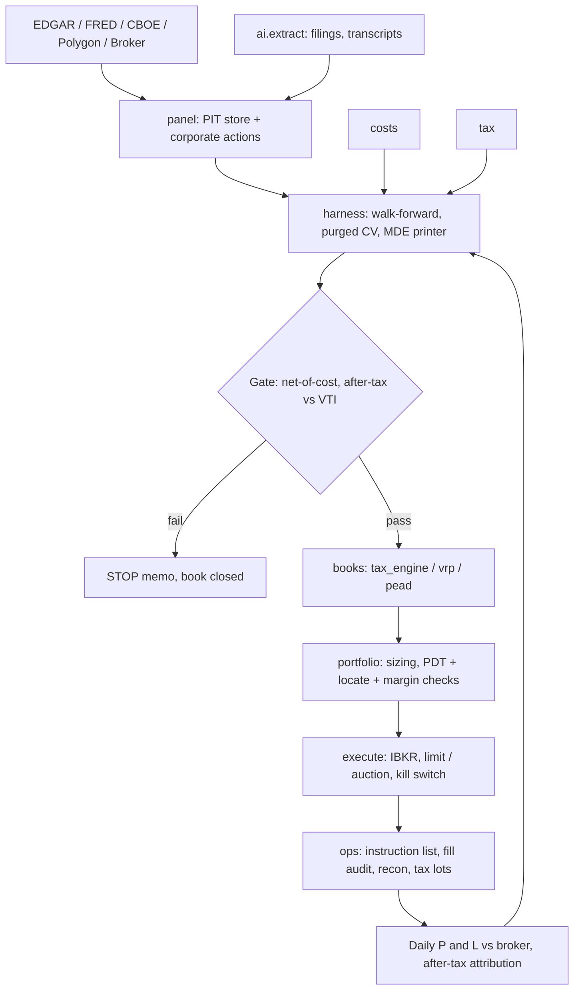

# Retail US desk — Architecture Blueprint

**Market:** US listed equities and related retail-accessible products (ETFs, listed index options, micro index futures).  
**Status:** **BLUEPRINT Rev 1** — unmeasured. Fresh start. No prior measurements exist for this programme.  
**Date:** 2026-08-20  
**Capital envelope:** $25,000 – $500,000 across taxable margin + IRA/Roth  
**Review:** Claude Opus, 2026-08-20. Derived from first principles of US retail economics. Not a dual-judge charter. Not a merge authority.

**Implementation map:** [us-equity-execution-plan.md](us-equity-execution-plan.md)

---

## One-line

For a US retail book of $25k–$500k, the binding constraints are the tax wrapper, the round-trip friction, and the inference budget — in that order — so the platform is a cheap passive core plus a small number of pre-registered active sleeves that must prove after-cost, after-tax excess over a VTI hold before a single dollar is risked.

---

## 0. Derivation — the constraint ladder

Alpha is the last rung, not the first. Each rung below can close a product outright. Work down in order.

### 0.1 Rung 1 — Tax wrapper

The wrapper decides which strategies are even arithmetically possible. Rates below are **working** assumptions for a serious retail desk (household income $200k–$500k, mid-tax state):

| Treatment | Rate (working) | Applies to |
|---|---|---|
| Short-term capital gain | **40%** (35% federal + ~5% state) | Any position held ≤ 365 days: equities, ETFs, SPY/QQQ options |
| Long-term capital gain | **20%** (15% + 3.8% NIIT, ~1% state effective) | Held > 365 days |
| Section 1256 60/40 | **28%** (0.6 × 20% + 0.4 × 40%) | SPX, XSP, NDX, RUT options; ES/MES/NQ/MNQ futures — *regardless of holding period*, marked to market at year end |
| Qualified dividends | 20% | Held 61 of 121 days around ex-date |
| IRA / Roth / 401(k) | **0%** on turnover | Long-only, unlevered, no short sales |

Four consequences, and they are structural:

1. **A 12× / year taxable equity strategy pays a 40% tax on every gain.** A gross 6%/yr edge nets 3.6% before friction. The same strategy inside an IRA nets 6%. **Asset location is worth more than most signals.** High-turnover long-only books belong in the IRA; the taxable account holds the long-term core, the hedges, and anything Section 1256.
2. **Section 1256 is a 12-point tax subsidy for index derivatives.** SPX/XSP options and MES futures are taxed at 28% blended even on a one-day hold. SPY and QQQ options — economically near-identical — are taxed at 40%. Any index-level strategy that can be expressed in SPX/XSP/MES *must* be. This is the single largest reliably capturable edge in this document, and it requires no forecast.
3. **Wash sale (IRC 1091) breaks naive harvesting.** A loss is disallowed if a substantially identical security is bought within 30 days before or after the sale, and the disallowed loss rolls into basis. A daily- or weekly-turnover single-name system generates a wash-sale tangle that no retail spreadsheet survives; worse, a loss washed into an **IRA purchase is permanently destroyed** (Rev. Rul. 2008-5), not deferred. Harvesting must therefore run on a small set of non-identical index substitutes with an enforced 31-day quarantine, or not at all.
4. **Section 475(f) mark-to-market is closed for v1.** It requires trader tax status, must be elected by the prior year's filing deadline, converts everything to ordinary income, and *forfeits* both long-term rates and 1256 60/40. It only helps a desk that expects large short-term losses. A desk that expects losses should not trade. **Closed.**

**Rung 1 verdict:** any strategy whose gross edge is less than ~1.7× its pre-tax hurdle is dead on arrival in the taxable account. IRA capacity ($7k/yr new contributions, **working**) caps how much of the book can hide from tax, so most of the taxable account must be low-turnover by construction.

### 0.2 Rung 2 — Friction and market structure

$0 commission is a routing arrangement, not zero cost. The real bill: half-spread paid (net of price improvement), Section 31 fee on sells (~$27.80 per $1M of proceeds, **working**, rate resets annually), FINRA TAF ($0.000166/share sold, capped $8.30, **working**), OCC clearing ($0.02/contract) and exchange ORF on options, plus per-contract broker fees ($0.65 typical).

Round-trip cost, all-in, at retail size (**working**, calibrate against own fills in P0):

| Product | Quoted spread | Fees, round trip | **All-in round trip** |
|---|---|---|---|
| SPY / VTI / QQQ | 1.0–1.5 bps | ~0.4 bps | **1.2–2.0 bps** |
| Top-200 large-cap stock | 0.5–2 bps | ~0.5 bps | **1.5–3 bps** |
| Mid-cap, $ADV $20–100M | 5–15 bps | ~0.6 bps | **10–25 bps** |
| Small-cap, $ADV $2–20M | 20–60 bps | ~0.8 bps | **45–120 bps** |
| MES (notional ~$32k) | 1 tick = $1.25 | ~$1.20 | **0.6–0.9 bps** |
| ES (notional ~$320k) | 1 tick = $12.50 | ~$4.50 | **0.5–0.7 bps** |
| SPX ATM, 30–45 DTE | 0.3–0.6% of premium/side | ~$1.50/contract | **1.0–2.0% of premium** |
| XSP ATM, 30–45 DTE | 2–4% of premium/side | ~$1.00/contract | **5–9% of premium** |
| SPX ~10-delta wing ($1–3 premium) | 5–15% of premium/side | ~$1.50/contract | **12–30% of premium** |
| SPY option ATM | 0.5–1% of premium/side | ~$1.30/contract | **1.5–3% of premium, taxed at 40%** |

Structural facts that follow:

- **Index beta is nearly free (MES/ES at <1 bp).** Single-stock beta is cheap in large caps and expensive below $20M ADV. Option *wings* are the most expensive instrument a retail desk can touch — a 20% round-trip premium cost means the strategy must be right about tail probability by more than 20% of premium, which no retail model is.
- **PDT (FINRA 4210):** 4+ day trades in 5 rolling business days in a margin account brands the account a pattern day trader and requires $25,000 minimum equity, else 90-day close-only restriction. Below $25k, the book gets **3 day trades per 5 days** — an inference budget of ~150 intraday bets a year, which is not enough to establish anything (see 0.3). Futures and options-on-futures are CFTC-regulated and **not** subject to PDT; this is the only clean route to intraday turnover under $25k.
- **T+1 since May 2024.** Cash accounts still face good-faith/free-riding violations; same-day turnover needs margin. Reg T gives 2:1; portfolio margin needs $125k, so only the top of the capital range can access it.
- **Shorting is a cost centre.** Reg SHO locate required; general-collateral borrow 0.25–0.5%/yr, hard-to-borrow 5–100%+, with recall risk at the worst moment. Short dividends are paid out of pocket and are not qualified. No shorting in an IRA. **Therefore: no cross-sectional long/short single-name book.** Hedge with MES, not with a short leg.
- **Routing and adverse selection.** Retail marketable flow is internalized under PFOF; the price improvement is real (often 0.2–0.4 bps better than NBBO) but so is the adverse selection when the desk is the informed side. Use limit orders and the closing auction (MOC/LOC, ~15:50 cutoff, the deepest liquidity of the day) for anything daily-rebalanced. Avoid the first and last five minutes of continuous trading. Extended hours spreads are 10–50× wider — closed for systematic use.
- **SIP vs direct feeds.** Consolidated-tape latency puts retail 1–15 ms behind the fastest participants. **Any strategy whose edge decays inside one second is closed permanently.** No exceptions, no v2.

### 0.3 Rung 3 — Inference budget

The desk cannot measure what it cannot resolve. Minimum detectable effect at two-sided 95% / 80% power:

**MDE ≈ 2.8 σ / √n**

| Book shape | n / yr | n over 5 yrs | σ per obs | **MDE** |
|---|---|---|---|---|
| Discretionary, 20 trades/yr | 20 | 100 | 200 bps | **56 bps/trade** |
| Monthly tactical rotation | 12 | 60 | 300 bps | **108 bps/month** |
| 30-DTE index option cycle (5 yrs) | 12 | 60 | 150 bps of book | **54 bps/cycle** |
| 30-DTE index option cycle (20 yrs history) | 12 | 240 | 150 bps | **27 bps/cycle** |
| Daily overnight rotation | 252 | 1,260 | 110 bps | **8.7 bps/day** |
| Earnings events, 1,500 names × 4 qtrs | 6,000 | 30,000 | 800 bps | **13 bps/event** |
| Same, after 5× clustering haircut | — | 6,000 | 800 bps | **29 bps/event** |

Read this table as a set of verdicts:

- **A 20-trade-a-year book cannot establish a 30 bp edge.** MDE is 56 bps. Two more decades of trading would not fix it. Any such book is faith, not measurement — closed.
- **Monthly portfolio-level series are useless for discovery.** MDE of 108 bps/month over five years exceeds any plausible edge. Breadth must come from the **cross-section** (name-periods), not from the portfolio time series.
- **Only the event-panel shape has real statistical power.** ~6,000 quasi-independent name-events per year resolves 13–29 bps. That is where discovery is allowed to happen.
- **The daily overnight rotation looks resolvable (8.7 bps) but is killed by rung 2**, not rung 3: 1.5 bps × 252 = 378 bps/yr of friction against a drift concentration worth maybe 300–500 bps gross, all taxed at 40%.

**Gate rule:** publish n, σ, and MDE *before* any test is run. If MDE > 0.5 × the hypothesized effect, the book is closed without a peek. Trial budget: **5 pre-registered specifications per book, α = 0.01**, with a deflated-Sharpe haircut for the number of trials actually run. Specification count is logged, including abandoned ones.

### 0.4 Rung 4 — Capacity

At $25k–$500k, capacity is almost never the bind. Precisely where it is and is not, using a 1%-of-ADV participation cap:

| Instrument | Capacity at $500k | Binding? |
|---|---|---|
| SPY / VTI / QQQ ($20B+ ADV) | Effectively unlimited | No |
| MES / ES (>1M contracts/day) | 15 MES = $480k notional; trivial | No |
| Top-500 US equity, $ADV > $100M | $1M+ per name | No |
| Mid-cap, $ADV $20M | $200k per name; 20-name sleeve fine | No |
| Small-cap, $ADV $2M | $20k per name → 25 names to deploy $500k | **Yes — and spread is 45–120 bps** |
| Micro-cap, $ADV < $500k | $5k per name | **Closed** |
| SPX ATM 30–45 DTE | Hundreds of contracts of OI | No |
| Single-name options, OTM wings | Quote moves on 20–50 contracts | **Yes** |

**Verdict:** capacity closes micro-cap, single-name option books, and OTM wings. For everything else in this document, cost and inference bind long before size does. This is the one genuine structural advantage of a retail book: it may fish in ponds an institution cannot enter — but the ponds that are small are also the ponds that are expensive, so the advantage is mostly theoretical.

### 0.5 Rung 5 — Alpha (only now)

**Baseline.** Expected US equity nominal return 7.0%/yr, vol 16%, Sharpe ~0.40 (**working**). After-tax VTI hold: 1.3% dividend yield at 20% = 26 bps drag, 3 bps expense ratio → **after-tax passive ≈ 6.7%/yr with zero research risk, zero operational risk, and zero forecast risk.** That is the number to beat. It is a very good number.

What is actually known about US equity return structure, and what survives the ladder:

| Phenomenon | Real? | Retail-viable after cost and tax? |
|---|---|---|
| Equity risk premium | Yes | **Yes — this is the core.** Default allocation. |
| Momentum (12-1) | Attenuated, still positive | **No in taxable** — 100–200%/yr turnover × 40% tax + 10–25 bps mid-cap friction ≈ 150–300 bps drag vs a 200–400 bps gross premium. Buy MTUM (0.15% ER) or run it in the IRA. |
| Value (HML) | Weak in large caps since 2007 | No as DIY. AVUV/VLUE in IRA if wanted. |
| Quality / profitability | Robust, low turnover | **Yes as an ETF tilt** (QUAL). Not as a DIY sort. |
| Low volatility | Robust, duration-correlated | ETF only (USMV/SPLV). |
| Overnight vs intraday split | Yes — most of SPY's cumulative return has historically accrued close→open | **Closed.** Harvesting it costs 378 bps/yr of crossings and pays 40% tax. The fact is real; the trade is not. |
| PEAD | Attenuated in large cap, present in mid | **Candidate — gate it.** Only book with the inference breadth to test honestly. |
| FOMC (8/yr) and CPI (12/yr) drift | Debatable | **Closed as alpha** — n = 20/yr, MDE ≈ 28 bps over 5 years against a plausible effect of the same size. Permitted only as a *variance-reduction overlay* (de-gross into the print), which requires no alpha proof. |
| OPEX / month-end / quarter-end effects | Small and crowded | Closed — 5–20 bps gross, 40% taxed, sub-cost. |
| Russell reconstitution (late June) | Flow is real | **Closed for retail.** Mid/small-cap names at 15–40 bps spread, the short side needs borrow, the effect has been front-run and smeared across multiple days since the mid-2000s, and n = 1 event/yr with near-total within-event correlation. No index-flow book will be built. |
| Index volatility risk premium | Yes — a risk transfer, not a mispricing, so publication does not arbitrage it away | **Candidate — and Section 1256 makes it 12 tax points better than the ETF version.** |
| ETF creation/redemption NAV arb | Real but AP-only | **Closed.** Retail is not an authorized participant. Structurally impossible. |
| 0DTE index options | A real volume phenomenon | **Closed as an alpha engine.** Realized ≈ implied at the one-day horizon post-2023; the strategy is a near-zero-drift, fat-tailed lottery where 1–3% of premium per round trip plus four-leg per-contract fees plus intraday gamma management consumes any residual carry. Permitted only as a same-day hedge instrument, never as a book. |
| Leveraged ETF compounding / "vol decay harvest" (short TQQQ+SQQQ) | Decay is real | **Closed.** Both legs need borrow (SQQQ frequently HTB at 5–15%), the paired short is a disguised short-gamma position with unbounded path risk, and the daily-reset drag is already in the price. |
| Day trading / intraday scalping | — | **Closed.** PDT cap below $25k, SIP latency, adverse selection on internalized marketable flow, 40% tax on 100% of P&L, and edge < cost at retail spread. |
| LLM news-sentiment next-day return | — | **Closed.** The information is public within milliseconds and its tradeable half-life is under one second. Retail cannot cross the spread in time. |
| Short rebate as income | — | **Closed.** For retail, borrow is a cost. Fully-paid lending programmes pay the client a minority share of a rate the broker sets; it is not a strategy. |

---

## 1. What the platform is — and is not

**Is:**

- A **cheap passive core** (60–90% of capital) in VTI/VXUS-type holdings, held long-term, rebalanced by band.
- A **tax and friction engine** that decides asset location, harvests losses safely, and picks the 1256 wrapper. It generates return by arithmetic, not by forecast.
- **One or two active sleeves**, each capped at 15–25% of capital, each of which has passed a published numeric hurdle after cost and after tax against an after-tax VTI hold.
- A **daily instruction list**, an **audit record of intended vs actual fills**, and a **broker reconciliation** — the three artefacts a passing book actually requires.

**Is not, in v1:** an event bus, Redis, Kafka, a feature store, a tick-replay engine, a custom matching engine, Kubernetes, a multi-broker abstraction layer, an intraday execution algo, a regime-switching model, an ML experiment tracker, a mobile app, a crypto venue, an options market-making stack, or a live account used as a research lab.

The v1 system runs once per session on one machine, writes a CSV of orders, and reconciles at 16:30 ET. If that sounds small, note that the entire edge in books C and A is available at that cadence.

---

## 2. Candidate books, ranked

Ranked by expected after-cost after-tax contribution **per unit of research risk** — not by expected return.

### Book C (rank 1) — Tax, location, and friction engine

- **Economic hypothesis.** For a $25k–$500k US taxable investor, the largest reliable and capacity-unconstrained source of after-tax excess is not price prediction but wrapper arithmetic: placing every high-turnover or income-heavy holding inside the IRA, expressing all index exposure in Section 1256 instruments, harvesting realized losses against short-term gains at 40% while deferring the offsetting gain to 20% long-term, and rebalancing on bands rather than on a calendar. The edge is a rate arbitrage plus the time value of deferral. It has no forecast risk because it makes no forecast.
- **Instrument and horizon.** VTI / ITOT / SCHB / VXUS core; MES for beta adjustment without realizing gains; harvest substitutes rotated on a 31-day quarantine. Horizon: permanent.
- **Effect size needed.** Hurdle for this book alone: **≥ 25 bps/yr** after-tax excess vs a static VTI hold. Realistic range 30–80 bps/yr in years with harvestable losses, decaying toward 20 bps as basis rises. Verified by **accounting proof**, not a statistical peek — this is a deterministic calculation on realized lots.
- **Why it exists in 2026.** It is not competed away because it is not a market price; it is a per-household arithmetic fact that most households do not compute.
- **Already in the price / packaged?** Partly — direct-indexing and robo TLH products sell exactly this for 25–40 bps/yr in fees, which is the whole edge. Doing it in-house keeps it.
- **Kill criteria.** If measured after-tax excess over one full tax year is below 25 bps, retire the harvesting module and keep only asset location, band rebalancing, and 1256 wrapper selection (which cost nothing to run).
- **AI role.** Ops only: anomaly detection on broker reconciliation and on wash-sale window violations. No modelling.

### Book A (rank 2) — Index volatility risk premium, defined-risk, Section 1256

- **Economic hypothesis.** Demand for index downside insurance structurally exceeds supply because the buyers are hedging balance sheets, not seeking expected value. The seller is paid for bearing gap and variance risk. Because it is a *risk transfer* rather than an information advantage, publication does not eliminate it — but the premium is compensation for a real, occasionally brutal, exposure (Feb 2018, Mar 2020, Aug 2024).
- **Instrument and horizon.** Short SPX put spreads, 30–45 DTE, short leg ~20–25 delta, width 50–100 index points, defined risk only, no naked short options, exit at 50% of credit captured or at 7–14 DTE. SPX chosen for: European-style (no early assignment), cash settlement (no share delivery), Section 1256 (28% vs 40%), and 1.0–2.0% round-trip cost vs 5–9% for XSP. XSP only if account size forces smaller granularity — and its cost must be charged honestly.
- **Effect size needed.** Sleeve at 20% of a $250k book, 12 cycles/yr, target contribution +200 bps at book level = $5,000/yr net → **$6,950/yr pre-tax at the 28% blend → ~$580 net credit retained per cycle.** Against ~$1,200 of credit collected per spread on $10,000 max loss, this requires retaining **≥ 25% of gross credit after all losses and all costs.** Historical put-spread carry retention has run 20–40%. The hypothesis is plausible; it is not free money.
- **Why it might already be in the price / packaged.** PUTW, XYLD, JEPI, SVOL and similar sell this exposure for 35–95 bps ER. Their distributions are largely ordinary income. **The DIY case rests primarily on the 12-point Section 1256 tax advantage and on the ability to size the sleeve, not on superior strike selection.** State that plainly and gate on it: DIY must beat the ETF *after tax*, not before.
- **Kill criteria, before any code.** Kill if any of: (a) walk-forward net-of-cost, after-tax sleeve Sharpe < 0.4 over 2005–2025; (b) sleeve max drawdown > 25% of sleeve notional; (c) the mean implied-minus-realized spread in the traded delta bucket is smaller than the modelled round-trip cost; (d) the sleeve fails to beat a PUTW-equivalent after tax by ≥ 75 bps/yr.
- **AI role.** **None.** There is nothing here for a language model to do.

### Book B (rank 3) — Post-earnings drift in liquid US mid- and large-caps, long-only, IRA-first

- **Economic hypothesis.** Earnings information is incorporated with a lag where analyst coverage is thin and attention is scarce. The lag shows up as drift in the direction of the surprise over 5–40 trading days. It has been attenuated in mega-caps by decades of publication; it may persist in the $2–20B band where the flow is smaller and the coverage thinner.
- **Instrument and horizon.** Single-name US equities, $ADV > $20M, top ~1,500 by liquidity. 5–40 day hold. **Long-only** — the short leg is closed by borrow cost and recall risk. Optional beta hedge in MES. **Run inside the IRA** so that 12× annual turnover is untaxed; that decision alone is worth ~240 bps/yr on a 6% gross sleeve.
- **Effect size needed.** Round-trip cost 10–25 bps in the mid-cap band. Require **gross per-event alpha ≥ 100 bps over the 20-day window** (≥ 4× cost), hit rate > 52%. At a 25% sleeve weight with 12 turns/yr, that is ~150–200 bps at book level inside the IRA. If the sleeve cannot be housed in the IRA, apply the 40% haircut and it fails — so IRA capacity is a hard precondition, not a preference.
- **Inference.** ~6,000 name-events/yr → MDE 13 bps raw, **29 bps after a 5× clustering haircut** for date and sector correlation. This is the only book in the document where discovery is statistically legitimate.
- **Why it might already be in the price.** Because it is the second-most-published anomaly in the literature and every institution screens on it. Assume it is dead in large caps and gate hard on the mid-cap subsample.
- **Kill criteria.** Kill if pooled net-of-cost drift in the $ADV > $20M universe over a 2010–2025 walk-forward is below **40 bps per event**, or if the effect is concentrated in the sub-$20M ADV tail (where cost eats it), or if it is entirely explained by momentum and short-interest controls.
- **AI role — real and specific.** An LLM builds **point-in-time features from unstructured text**: 8-K/10-Q press-release surprise versus consensus, guidance direction change, and the language delta between successive earnings calls. Hard rules: the model sees only text published before the timestamp it is labelled with; the model outputs *features*, never a return forecast; every extraction is cached, versioned, and re-runnable; and the incremental value of text features over numeric surprise alone must be shown separately or the LLM is removed from the pipeline.

### Explicitly closed, do not revisit without new market structure

Day trading and intraday scalping · 0DTE as an alpha book · overnight close-to-open rotation · DIY taxable factor sorts · leveraged-ETF decay harvesting · cross-sectional long/short single-name · Russell reconstitution and all index-flow books · FOMC/CPI event alpha · OPEX and calendar effects · LLM news-sentiment prediction · ETF NAV arbitrage · micro-cap anything · short-rebate income · Section 475(f) election.

---

## 3. Platform architecture — production-grade, staged

### 3.1 Data: buy exactly two things

| Source | Cost | Role | v1? |
|---|---|---|---|
| Broker (IBKR) historical + live | included | Live quotes, fills, positions, corporate-action confirms | **Yes** |
| SEC EDGAR (submissions API, full-text) | free | Point-in-time filings with filing timestamps — the only true PIT source that is free | **Yes** |
| FRED | free | Rates, macro calendar | **Yes** |
| CBOE (index option EOD quotes/settles) | free tier + paid history | Book A: SPX implied vs realized by delta bucket | **Yes, paid history only for the years Book A needs** |
| Polygon (Stocks Developer tier) | ~$79–199/mo (**working**) | Adjusted daily bars, splits/dividends, **delisted tickers** (survivorship) | **Yes** |
| Sharadar SF1/SEP or equivalent PIT fundamentals | ~$100/mo (**working**) | Book B consensus/fundamental PIT panel | **Only if B1 passes** |
| Databento / tick data | $$$ | Microstructure | **No. Ever, at this capital scale.** |

Non-negotiable data rules: every panel carries a **point-in-time timestamp and a knowledge date**; delisted and acquired tickers are present (survivorship bias inflates every equity backtest); corporate actions are applied from a single canonical source and unit-tested against three known splits and three known special dividends.

### 3.2 Modules

| Module | Responsibility | Notes |
|---|---|---|
| `costs` | Spread, fees, Section 31/TAF/OCC/ORF, borrow, per-product round-trip | First-class object. Unit-tested. Every backtest imports it; none re-implements it. |
| `tax` | ST/LT/1256/qualified-dividend rates, wash-sale windows, lot accounting, after-tax return series | Unit-tested against hand-worked examples including an IRA wash-sale destruction case. |
| `universe` | PIT listing panel, ADV, delistings, ETF metadata | |
| `panel` | Polars daily/event panels, aligned on knowledge date | Polars, typed signatures, `df in → df out` |
| `harness` | Walk-forward, purged + embargoed CV, MDE printer, trial ledger, deflated Sharpe | **Refuses to run a test until n, σ, and MDE are printed.** |
| `books.tax_engine` | Book C: location, bands, harvest candidates, 31-day quarantine | |
| `books.vrp` | Book A: strike/expiry selection, credit targets, sleeve sizing | |
| `books.pead` | Book B: event panel, surprise features, ranking | |
| `ai.extract` | LLM filing/transcript extraction, cached and versioned | Features only |
| `portfolio` | Sizing, gross/net limits, beta target, PDT counter, locate check | |
| `execute` | IBKR adapter, limit/MOC/LOC/adaptive, kill switch, dry-run mode | |
| `ops` | Instruction list, fill audit, daily P&L vs broker, tax-lot ledger, recon report | |

### 3.3 Component flow

### 3.4 Execution posture

Limit orders inside the 09:35–15:55 ET window; MOC/LOC for daily rebalances; adaptive-limit for options with a hard price cap at mid + 25% of spread and no chasing. Every session begins in dry-run: the instruction list is generated, diffed against current positions, and only then armed. Kill switch on three triggers: daily loss > 1.5% of equity, broker API error rate above threshold, or position/quote staleness beyond 90 seconds. PDT counter blocks the fourth day trade in five sessions unless equity > $25k. Locate check blocks any short. **Paper for 60 sessions, then live at 10% of target size for 60 sessions, then full size.**

### 3.5 Risk limits (v1)

| Limit | Value |
|---|---|
| Max single-name weight | 4% of equity |
| Max active-sleeve gross | 25% of equity per book, 40% total |
| Max daily loss (kill switch) | 1.5% of equity |
| Max option sleeve max-loss-at-expiry | 8% of equity |
| Beta band around target | ±0.10 |
| Naked short options | Prohibited |
| Short stock | Prohibited in v1 |
| Overnight leverage | ≤ 1.0× in v1 |
| Live capital during research | $0 |

### 3.6 AI layer — jobs, not thesis

Permitted: point-in-time filing and transcript extraction (Book B features); event detection and calendar normalization; reconciliation anomaly explanation; code generation and test writing; documentation. Prohibited: any model, language or otherwise, that outputs a return forecast consumed directly by sizing; any signal whose provenance cannot be reconstructed to a timestamped source document.

### 3.7 Not in v1 — explicit

Tick replay · custom matching engine · Kubernetes/Docker orchestration · Redis/Kafka · feature store · MLflow · HMM or regime-switching models · LightGBM/XGBoost/RL · Kaggle-style ensembling · multi-broker abstraction · options market making · crypto · intraday execution algos · web dashboard.

---

## 4. Hurdles and STOP language

Published before any measurement, and not adjustable after seeing a result.

| ID | Hurdle |
|---|---|
| H1 | Total book, after-cost and after-tax, must beat an after-tax VTI hold by **≥ 200 bps/yr** over the evaluation window, with excess-return Sharpe ≥ 0.5. |
| H2 | Total book max drawdown must not exceed the passive benchmark's max drawdown over the same window. |
| H3 | **MDE must be printed before every peek.** If MDE > 0.5 × hypothesized effect, the test is not run and the book closes. |
| H4 | Modelled cost must match realized fills within **3 bps** (equities) or **0.3% of premium** (options) before any size increase. |
| H5 | Per-book minimums: Book C ≥ 25 bps/yr after-tax excess (accounting proof); Book A ≥ 75 bps/yr after-tax over the ETF equivalent, sleeve Sharpe ≥ 0.4; Book B ≥ 40 bps net drift per event on ≥ 6,000 clustered events. |
| H6 | Trial budget 5 pre-registered specs per book at α = 0.01, deflated for trials actually run. A sixth spec requires a new pre-registration and a fresh data window. |
| **STOP** | **If the harness is validated and every book's point estimate is below its H5 minimum, the programme stops.** Capital goes 100% to the passive core plus IRA factor ETFs plus Book C's location and band logic. Reopening requires *new data*, not new specifications. |

A negative result that is honestly measured is a successful milestone. Recording it and stopping is the intended behaviour, not a failure.

---

## 5. Risks unique to US retail algo

| Risk | Mitigation |
|---|---|
| PDT tripwire (90-day close-only) | Hard PDT counter in `portfolio`; express intraday turnover in futures only |
| Wash-sale failure; loss permanently destroyed via IRA purchase | 31-day quarantine enforced in code across **all** accounts jointly, including IRA; harvest only from a whitelisted substitute set |
| Tax-lot drift vs broker 1099-B | Reconcile own lot ledger to broker monthly; broker's cost basis is authoritative for filing |
| Early assignment / share delivery | SPX only (European, cash-settled). No American-style short options in v1 |
| Hard-to-borrow recall at the worst time | No short stock in v1 |
| Broker outage or API deprecation | Kill switch; flat-able positions only; documented manual close procedure; no strategy that *requires* intraday intervention to survive |
| PFOF adverse selection | Limit and auction orders; measure own effective spread vs NBBO monthly and feed it back into `costs` |
| Year-end 1256 mark-to-market surprise | `tax` models the December mark; reserve cash for it |
| Using the live account as a research lab | Research runs on historical panels; live account executes only pre-registered, gate-passed books |
| Regulatory scope creep (SEC marketing rule, RIA registration) | Own capital only. No third-party money, no performance advertising, no signal subscriptions. Anything else changes the legal entity and is out of scope |
| Over-fitting via spec search | Trial ledger, pre-registration, deflated Sharpe, embargoed CV |
| Single-machine failure | Positions survive machine loss by construction (no intraday dependence); nightly encrypted state backup |
